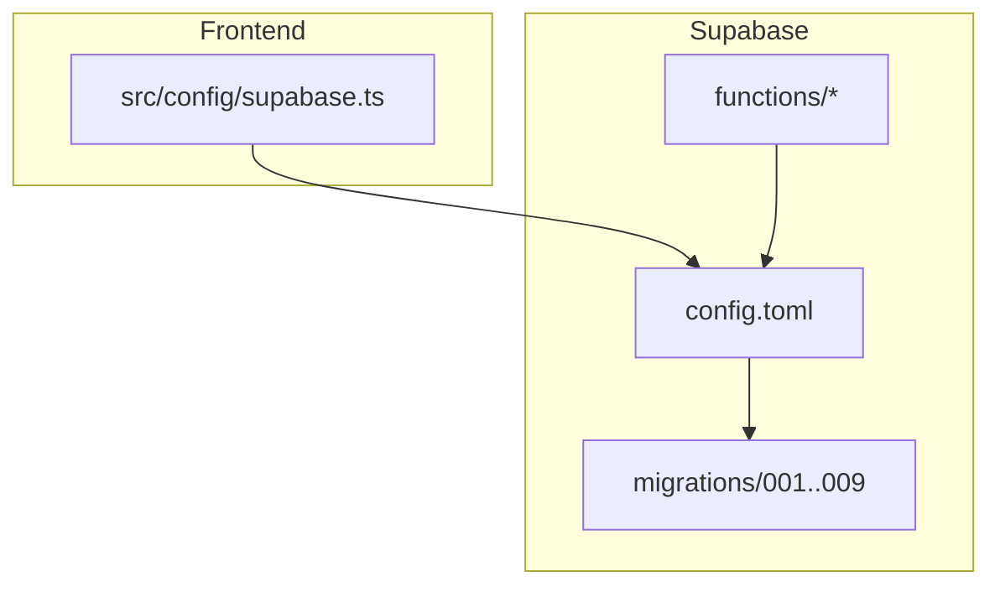
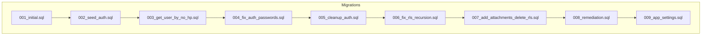
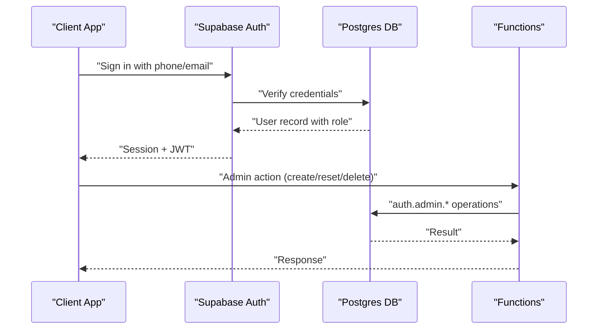
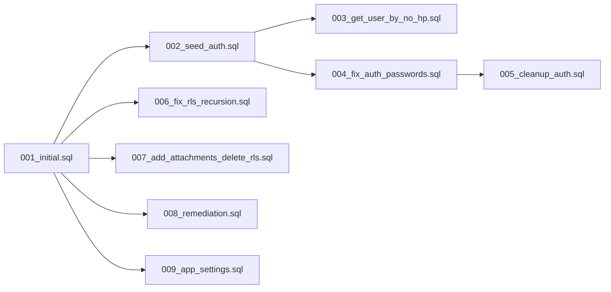

# Migration System

<cite>
**Referenced Files in This Document**
- [001_initial.sql](file://supabase/migrations/001_initial.sql)
- [002_seed_auth.sql](file://supabase/migrations/002_seed_auth.sql)
- [003_get_user_by_no_hp.sql](file://supabase/migrations/003_get_user_by_no_hp.sql)
- [004_fix_auth_passwords.sql](file://supabase/migrations/004_fix_auth_passwords.sql)
- [005_cleanup_auth.sql](file://supabase/migrations/005_cleanup_auth.sql)
- [006_fix_rls_recursion.sql](file://supabase/migrations/006_fix_rls_recursion.sql)
- [007_add_attachments_delete_rls.sql](file://supabase/migrations/007_add_attachments_delete_rls.sql)
- [008_remediation.sql](file://supabase/migrations/008_remediation.sql)
- [009_app_settings.sql](file://supabase/migrations/009_app_settings.sql)
- [config.toml](file://supabase/config.toml)
- [supabase.ts](file://src/config/supabase.ts)
- [admin-user/index.ts](file://supabase/functions/admin-user/index.ts)
</cite>

## Table of Contents
1. [Introduction](#introduction)
2. [Project Structure](#project-structure)
3. [Core Components](#core-components)
4. [Architecture Overview](#architecture-overview)
5. [Detailed Component Analysis](#detailed-component-analysis)
6. [Dependency Analysis](#dependency-analysis)
7. [Performance Considerations](#performance-considerations)
8. [Troubleshooting Guide](#troubleshooting-guide)
9. [Conclusion](#conclusion)
10. [Appendices](#appendices)

## Introduction
This document explains the database evolution strategy for AbsensiOnline using a sequential migration system. It documents the nine migrations from 001 to 009, detailing schema changes, data transformations, feature additions, authentication setup, user management improvements, Row Level Security (RLS) policy fixes, and application settings configuration. It also covers migration execution, rollback strategies, version control practices, and guidance for adding new migrations while maintaining backward compatibility and handling production deployments safely.

## Project Structure
The migration system resides under supabase/migrations and is complemented by Supabase configuration and client setup:
- Migrations define schema, data, and policies in order.
- Supabase configuration controls API, DB, Studio, Auth, Storage, and Functions.
- The frontend client connects to Supabase using environment variables.

**Diagram sources**
- [config.toml:1-43](file://supabase/config.toml#L1-L43)
- [supabase.ts:1-7](file://src/config/supabase.ts#L1-L7)

**Section sources**
- [config.toml:1-43](file://supabase/config.toml#L1-L43)
- [supabase.ts:1-7](file://src/config/supabase.ts#L1-L7)

## Core Components
- Initial schema (001): Defines zones, shifts, users, attendances, attachments with constraints, indexes, triggers, and helper functions.
- Authentication seeding (002): Seeds Supabase Auth users with bcrypt hashes.
- Login helper (003): Provides a secure function to fetch active users by phone number.
- Password fix (004): Ensures bcrypt hashes are generated properly via pgcrypto.
- Cleanup (005): Removes broken auth users to resolve conflicts.
- RLS recursion fix (006): Replaces recursive policies with JWT-based checks.
- Attachments delete policy (007): Adds missing delete policy for attachments.
- Remediation (008): Automates status derivation and enforces daily check-in uniqueness.
- Application settings (009): Singleton table for configurable app-wide settings with RLS.

**Section sources**
- [001_initial.sql:1-303](file://supabase/migrations/001_initial.sql#L1-L303)
- [002_seed_auth.sql:1-29](file://supabase/migrations/002_seed_auth.sql#L1-L29)
- [003_get_user_by_no_hp.sql:1-31](file://supabase/migrations/003_get_user_by_no_hp.sql#L1-L31)
- [004_fix_auth_passwords.sql:1-47](file://supabase/migrations/004_fix_auth_passwords.sql#L1-L47)
- [005_cleanup_auth.sql:1-9](file://supabase/migrations/005_cleanup_auth.sql#L1-L9)
- [006_fix_rls_recursion.sql:1-78](file://supabase/migrations/006_fix_rls_recursion.sql#L1-L78)
- [007_add_attachments_delete_rls.sql:1-7](file://supabase/migrations/007_add_attachments_delete_rls.sql#L1-L7)
- [008_remediation.sql:1-35](file://supabase/migrations/008_remediation.sql#L1-L35)
- [009_app_settings.sql:1-46](file://supabase/migrations/009_app_settings.sql#L1-L46)

## Architecture Overview
The migration architecture evolves the database in a deterministic sequence. Each migration builds upon previous ones, ensuring schema integrity and feature completeness. The system integrates:
- Supabase Auth for identity and session management.
- Supabase RLS for row-level access control.
- Postgres functions and triggers for computed logic and data integrity.
- A singleton settings table for centralized configuration.

**Diagram sources**
- [001_initial.sql:1-303](file://supabase/migrations/001_initial.sql#L1-L303)
- [002_seed_auth.sql:1-29](file://supabase/migrations/002_seed_auth.sql#L1-L29)
- [003_get_user_by_no_hp.sql:1-31](file://supabase/migrations/003_get_user_by_no_hp.sql#L1-L31)
- [004_fix_auth_passwords.sql:1-47](file://supabase/migrations/004_fix_auth_passwords.sql#L1-L47)
- [005_cleanup_auth.sql:1-9](file://supabase/migrations/005_cleanup_auth.sql#L1-L9)
- [006_fix_rls_recursion.sql:1-78](file://supabase/migrations/006_fix_rls_recursion.sql#L1-L78)
- [007_add_attachments_delete_rls.sql:1-7](file://supabase/migrations/007_add_attachments_delete_rls.sql#L1-L7)
- [008_remediation.sql:1-35](file://supabase/migrations/008_remediation.sql#L1-L35)
- [009_app_settings.sql:1-46](file://supabase/migrations/009_app_settings.sql#L1-L46)

## Detailed Component Analysis

### Migration 001: Initial Schema
- Purpose: Establish baseline schema with zones, shifts, users, attendances, attachments.
- Key changes:
  - Creates tables with UUID primary keys, timestamps, and domain-specific constraints.
  - Adds indexes for performance on frequently queried columns.
  - Implements a generic update timestamp trigger and a helper function to compute attendance status.
  - Enables RLS on all tables and defines per-table policies for select/update/delete.
  - Seeds initial zones, shifts, and users with realistic data.
- Impact: Provides the foundation for geofencing, scheduling, user roles, attendance tracking, and photo/document attachments.

**Section sources**
- [001_initial.sql:11-113](file://supabase/migrations/001_initial.sql#L11-L113)
- [001_initial.sql:118-161](file://supabase/migrations/001_initial.sql#L118-L161)
- [001_initial.sql:166-279](file://supabase/migrations/001_initial.sql#L166-L279)
- [001_initial.sql:288-303](file://supabase/migrations/001_initial.sql#L288-L303)

### Migration 002: Seed Auth Users
- Purpose: Populate Supabase Auth users with bcrypt-hashed passwords.
- Key changes:
  - Inserts two initial users into auth.users with metadata and confirmed emails.
  - Uses ON CONFLICT to avoid duplicates during development.
- Impact: Enables login for seeded users and aligns with the login helper function.

**Section sources**
- [002_seed_auth.sql:1-29](file://supabase/migrations/002_seed_auth.sql#L1-L29)

### Migration 003: Login Helper Function
- Purpose: Provide a secure function to lookup active users by phone number for login.
- Key changes:
  - Creates a SECURITY DEFINER function to bypass RLS for internal lookup.
  - Filters only active users and returns selected profile fields.
- Impact: Supports phone-number-based login flow without exposing sensitive data.

**Section sources**
- [003_get_user_by_no_hp.sql:6-31](file://supabase/migrations/003_get_user_by_no_hp.sql#L6-L31)

### Migration 004: Fix Auth Password Hashes
- Purpose: Correctly hash passwords using pgcrypto if previously missing.
- Key changes:
  - Ensures pgcrypto extension exists.
  - Deletes broken users and re-inserts with proper bcrypt hashes.
  - Updates existing records atomically.
- Impact: Resolves authentication failures due to incorrect hashing.

**Section sources**
- [004_fix_auth_passwords.sql:6-47](file://supabase/migrations/004_fix_auth_passwords.sql#L6-L47)

### Migration 005: Cleanup Broken Auth Users
- Purpose: Emergency cleanup of malformed auth users.
- Key changes:
  - Removes specific users by email address.
- Impact: Prevents conflicts and ensures clean state for subsequent auth operations.

**Section sources**
- [005_cleanup_auth.sql:5-9](file://supabase/migrations/005_cleanup_auth.sql#L5-L9)

### Migration 006: Fix RLS Recursion
- Purpose: Eliminate recursive RLS policies causing server errors.
- Key changes:
  - Drops recursive policies that checked users from within users.
  - Replaces with JWT-based checks using auth.jwt().
  - Applies fixes across zones, shifts, users, attendances, and attachments.
- Impact: Resolves 500 errors and improves reliability for admin operations.

**Section sources**
- [006_fix_rls_recursion.sql:7-78](file://supabase/migrations/006_fix_rls_recursion.sql#L7-L78)

### Migration 007: Add Attachments Delete Policy
- Purpose: Enable admins to delete attachments.
- Key changes:
  - Adds a DELETE policy for authenticated users with admin roles.
- Impact: Completes administrative control over attachment lifecycle.

**Section sources**
- [007_add_attachments_delete_rls.sql:4-7](file://supabase/migrations/007_add_attachments_delete_rls.sql#L4-L7)

### Migration 008: Remediation
- Purpose: Improve data integrity and automation.
- Key changes:
  - Creates a function to set attendance status based on check-in time and shift tolerance.
  - Attaches BEFORE INSERT/UPDATE triggers to compute status automatically.
  - Enforces a unique index for one check-in per user per day in WIB.
- Impact: Reduces manual status updates and prevents duplicate daily check-ins.

**Section sources**
- [008_remediation.sql:7-35](file://supabase/migrations/008_remediation.sql#L7-L35)

### Migration 009: Application Settings
- Purpose: Centralize application-wide configuration.
- Key changes:
  - Creates a singleton app_settings table with strict constraints.
  - Seeds default values and adds an update trigger.
  - Enables RLS with authenticated select and admin update policy.
- Impact: Provides a single source of truth for configurable parameters like timezone, radius, tolerances, and limits.

**Section sources**
- [009_app_settings.sql:5-46](file://supabase/migrations/009_app_settings.sql#L5-L46)

### Authentication and User Management Flow
This sequence illustrates how login and admin operations interact with the database and functions.

**Diagram sources**
- [003_get_user_by_no_hp.sql:6-31](file://supabase/migrations/003_get_user_by_no_hp.sql#L6-L31)
- [admin-user/index.ts:30-49](file://supabase/functions/admin-user/index.ts#L30-L49)
- [admin-user/index.ts:58-154](file://supabase/functions/admin-user/index.ts#L58-L154)

## Dependency Analysis
- Sequential dependencies: Each migration depends on prior migrations’ completion.
- Functional dependencies:
  - 003_get_user_by_no_hp.sql relies on users table from 001_initial.sql.
  - 004_fix_auth_passwords.sql depends on pgcrypto and auth.users from 002_seed_auth.sql.
  - 006_fix_rls_recursion.sql depends on JWT presence and existing policies.
  - 008_remediation.sql depends on derive_attendance_status from 001_initial.sql.
  - 009_app_settings.sql introduces a new table independent of others but interacts with RLS.
- External dependencies:
  - Supabase configuration (config.toml) governs API, DB, Auth, and Storage behavior.
  - Frontend client (supabase.ts) connects to Supabase using environment variables.

**Diagram sources**
- [001_initial.sql:1-303](file://supabase/migrations/001_initial.sql#L1-L303)
- [002_seed_auth.sql:1-29](file://supabase/migrations/002_seed_auth.sql#L1-L29)
- [003_get_user_by_no_hp.sql:1-31](file://supabase/migrations/003_get_user_by_no_hp.sql#L1-L31)
- [004_fix_auth_passwords.sql:1-47](file://supabase/migrations/004_fix_auth_passwords.sql#L1-L47)
- [005_cleanup_auth.sql:1-9](file://supabase/migrations/005_cleanup_auth.sql#L1-L9)
- [006_fix_rls_recursion.sql:1-78](file://supabase/migrations/006_fix_rls_recursion.sql#L1-L78)
- [007_add_attachments_delete_rls.sql:1-7](file://supabase/migrations/007_add_attachments_delete_rls.sql#L1-L7)
- [008_remediation.sql:1-35](file://supabase/migrations/008_remediation.sql#L1-L35)
- [009_app_settings.sql:1-46](file://supabase/migrations/009_app_settings.sql#L1-L46)

**Section sources**
- [config.toml:1-43](file://supabase/config.toml#L1-L43)
- [supabase.ts:1-7](file://src/config/supabase.ts#L1-L7)

## Performance Considerations
- Indexes: Predefined indexes on foreign keys and frequently filtered columns improve query performance.
- Triggers: Status derivation and updated_at triggers add minimal overhead but ensure data correctness.
- Constraints: Domain constraints prevent invalid data and reduce runtime checks.
- Singleton settings: Centralized configuration avoids repeated lookups and supports caching at the application level.

[No sources needed since this section provides general guidance]

## Troubleshooting Guide
Common issues and resolutions:
- Authentication failures after seeding:
  - Ensure pgcrypto is available and users are inserted with bcrypt hashes.
  - Use cleanup migration to remove broken entries before retrying.
- RLS errors or 500 responses:
  - Replace recursive policies with JWT-based checks.
  - Verify auth.jwt() availability and correct metadata paths.
- Missing delete permissions for attachments:
  - Apply the attachments delete policy migration.
- Duplicate check-ins per day:
  - Enforce unique index on user_id plus date derived from checkin_at.
- Settings not applied:
  - Confirm singleton id and constraints; ensure admin role can update.

**Section sources**
- [004_fix_auth_passwords.sql:6-47](file://supabase/migrations/004_fix_auth_passwords.sql#L6-L47)
- [005_cleanup_auth.sql:5-9](file://supabase/migrations/005_cleanup_auth.sql#L5-L9)
- [006_fix_rls_recursion.sql:14-28](file://supabase/migrations/006_fix_rls_recursion.sql#L14-L28)
- [007_add_attachments_delete_rls.sql:4-7](file://supabase/migrations/007_add_attachments_delete_rls.sql#L4-L7)
- [008_remediation.sql:30-35](file://supabase/migrations/008_remediation.sql#L30-L35)
- [009_app_settings.sql:36-46](file://supabase/migrations/009_app_settings.sql#L36-L46)

## Conclusion
The migration system establishes a robust, versioned evolution of AbsensiOnline’s database. By sequencing schema creation, authentication setup, policy hardening, and feature enhancements, it ensures data integrity, operational reliability, and maintainable configuration. Following the practices outlined here will support safe production deployments and future extensibility.

[No sources needed since this section summarizes without analyzing specific files]

## Appendices

### Migration Execution and Rollback Strategies
- Execution:
  - Run migrations in ascending order using Supabase CLI or dashboard.
  - Monitor for constraint violations and policy conflicts.
- Rollback:
  - Prefer forward-compatible changes; otherwise, implement reverse migrations (e.g., drop policies, revert indexes).
  - Use transactional blocks where possible to minimize downtime.

[No sources needed since this section provides general guidance]

### Adding New Migrations
- Naming: Use three-digit sequential prefixes (e.g., 010_, 011_) following the last existing migration.
- Content:
  - Keep idempotent operations (DROP IF EXISTS, ON CONFLICT).
  - Add indexes and constraints alongside schema changes.
  - Update RLS policies consistently.
- Testing:
  - Validate against staging with representative datasets.
  - Verify triggers, functions, and policies behave as expected.

[No sources needed since this section provides general guidance]

### Production Deployment Checklist
- Back up the database before applying migrations.
- Review logs for errors and warnings.
- Confirm Supabase configuration matches environment variables.
- Test login, admin functions, and RLS policies post-deployment.

**Section sources**
- [config.toml:24-41](file://supabase/config.toml#L24-L41)
- [supabase.ts:3-6](file://src/config/supabase.ts#L3-L6)