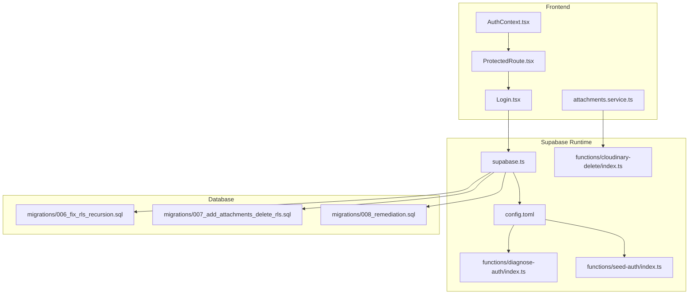
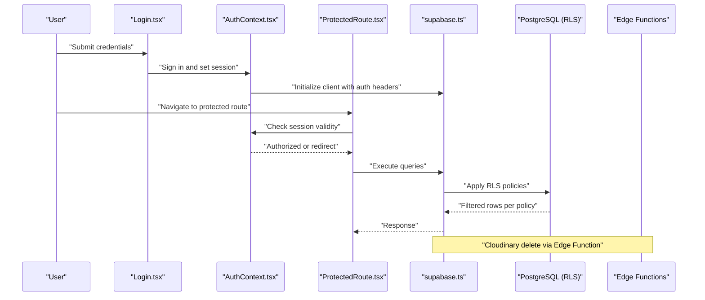
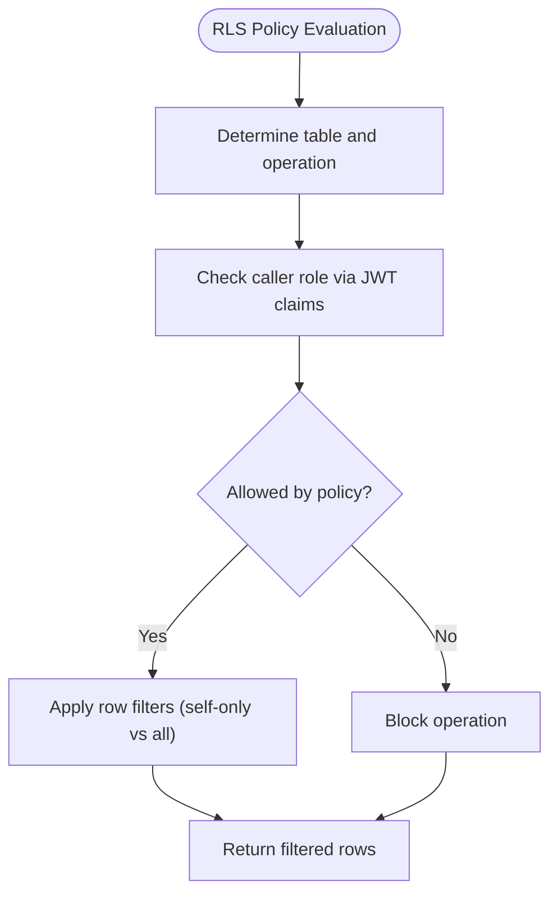
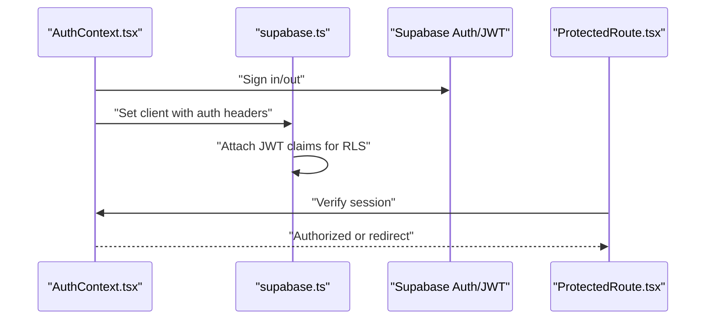
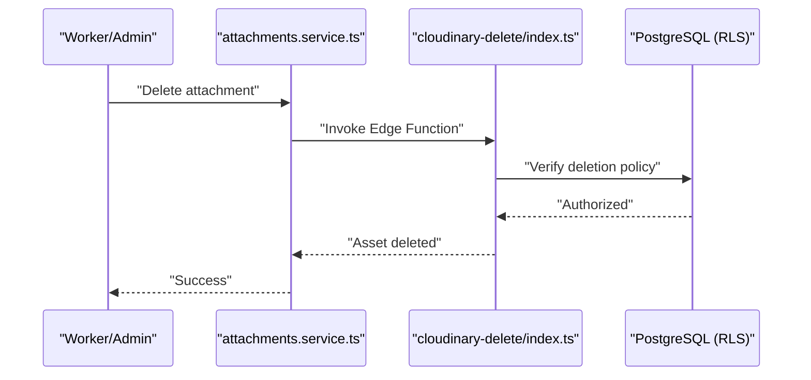
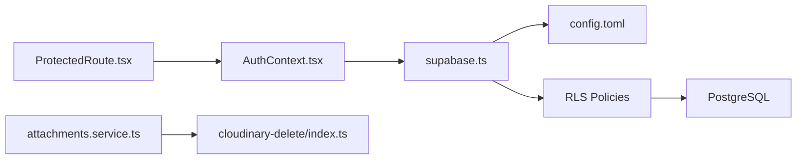

# Security Policies

<cite>
**Referenced Files in This Document**
- [SPEC.md](file://SPEC.md)
- [006_fix_rls_recursion.sql](file://supabase/migrations/006_fix_rls_recursion.sql)
- [007_add_attachments_delete_rls.sql](file://supabase/migrations/007_add_attachments_delete_rls.sql)
- [008_remediation.sql](file://supabase/migrations/008_remediation.sql)
- [supabase.ts](file://src/config/supabase.ts)
- [AuthContext.tsx](file://src/context/AuthContext.tsx)
- [useAuth.ts](file://src/hooks/useAuth.ts)
- [ProtectedRoute.tsx](file://src/components/ProtectedRoute.tsx)
- [Login.tsx](file://src/components/Login.tsx)
- [attachments.service.ts](file://src/services/attachments.service.ts)
- [cloudinary.ts](file://src/utils/cloudinary.ts)
- [cloudinary-delete/index.ts](file://supabase/functions/cloudinary-delete/index.ts)
- [diagnose-auth/index.ts](file://supabase/functions/diagnose-auth/index.ts)
- [seed-auth/index.ts](file://supabase/functions/seed-auth/index.ts)
- [config.toml](file://supabase/config.toml)
</cite>

## Table of Contents
1. [Introduction](#introduction)
2. [Project Structure](#project-structure)
3. [Core Components](#core-components)
4. [Architecture Overview](#architecture-overview)
5. [Detailed Component Analysis](#detailed-component-analysis)
6. [Dependency Analysis](#dependency-analysis)
7. [Performance Considerations](#performance-considerations)
8. [Troubleshooting Guide](#troubleshooting-guide)
9. [Conclusion](#conclusion)
10. [Appendices](#appendices)

## Introduction
This document defines the security policies for the Supabase-backed AbsensiOnline application. It covers Row Level Security (RLS) policies, remediation actions, database roles and access control, authentication and session handling, data protection, audit and vulnerability assessment, and incident response. The goal is to ensure secure access to sensitive data while supporting the operational needs of administrators, supervisors, and workers.

## Project Structure
Security-relevant areas of the codebase include:
- Supabase configuration and migration-driven RLS policies
- Authentication context and route protection in the frontend
- Supabase client initialization and runtime configuration
- Supabase Edge Functions for auxiliary security tasks
- Cloud storage integration and deletion safeguards

**Diagram sources**
- [supabase.ts](file://src/config/supabase.ts)
- [AuthContext.tsx](file://src/context/AuthContext.tsx)
- [ProtectedRoute.tsx](file://src/components/ProtectedRoute.tsx)
- [Login.tsx](file://src/components/Login.tsx)
- [attachments.service.ts](file://src/services/attachments.service.ts)
- [cloudinary-delete/index.ts](file://supabase/functions/cloudinary-delete/index.ts)
- [diagnose-auth/index.ts](file://supabase/functions/diagnose-auth/index.ts)
- [seed-auth/index.ts](file://supabase/functions/seed-auth/index.ts)
- [config.toml](file://supabase/config.toml)
- [006_fix_rls_recursion.sql](file://supabase/migrations/006_fix_rls_recursion.sql)
- [007_add_attachments_delete_rls.sql](file://supabase/migrations/007_add_attachments_delete_rls.sql)
- [008_remediation.sql](file://supabase/migrations/008_remediation.sql)

**Section sources**
- [supabase.ts](file://src/config/supabase.ts)
- [config.toml](file://supabase/config.toml)
- [006_fix_rls_recursion.sql](file://supabase/migrations/006_fix_rls_recursion.sql)
- [007_add_attachments_delete_rls.sql](file://supabase/migrations/007_add_attachments_delete_rls.sql)
- [008_remediation.sql](file://supabase/migrations/008_remediation.sql)

## Core Components
- Supabase client initialization and runtime configuration
- Authentication context and protected routing
- Edge Functions for diagnostics, seeding, and Cloudinary cleanup
- Migration-driven RLS policies for users, zones, shifts, and attendances
- Attachment service and Cloudinary integration with deletion safeguards

**Section sources**
- [supabase.ts](file://src/config/supabase.ts)
- [AuthContext.tsx](file://src/context/AuthContext.tsx)
- [ProtectedRoute.tsx](file://src/components/ProtectedRoute.tsx)
- [Login.tsx](file://src/components/Login.tsx)
- [cloudinary-delete/index.ts](file://supabase/functions/cloudinary-delete/index.ts)
- [006_fix_rls_recursion.sql](file://supabase/migrations/006_fix_rls_recursion.sql)
- [007_add_attachments_delete_rls.sql](file://supabase/migrations/007_add_attachments_delete_rls.sql)
- [008_remediation.sql](file://supabase/migrations/008_remediation.sql)

## Architecture Overview
The security architecture integrates Supabase’s RLS, JWT claims, and Edge Functions with frontend authentication guards and service-layer controls.

**Diagram sources**
- [Login.tsx](file://src/components/Login.tsx)
- [AuthContext.tsx](file://src/context/AuthContext.tsx)
- [ProtectedRoute.tsx](file://src/components/ProtectedRoute.tsx)
- [supabase.ts](file://src/config/supabase.ts)
- [006_fix_rls_recursion.sql](file://supabase/migrations/006_fix_rls_recursion.sql)
- [cloudinary-delete/index.ts](file://supabase/functions/cloudinary-delete/index.ts)

## Detailed Component Analysis

### Row Level Security (RLS) Policies and Remediation
- Users table
  - Admins and super admins can select/update/delete all users.
  - Workers can only select/update/delete their own profile.
  - A prior recursive policy was removed and replaced with a non-recursive check using JWT claims.
- Zones and Shifts tables
  - Authenticated users can read; admins have full CRUD permissions.
- Attendances table
  - Admins can view/update/delete all records.
  - Workers can view and insert their own records; updates are restricted to their own records.
- Attachments deletion
  - A dedicated policy ensures only authorized deletions occur during attachment removal workflows.

**Diagram sources**
- [SPEC.md](file://SPEC.md)
- [006_fix_rls_recursion.sql](file://supabase/migrations/006_fix_rls_recursion.sql)
- [007_add_attachments_delete_rls.sql](file://supabase/migrations/007_add_attachments_delete_rls.sql)
- [008_remediation.sql](file://supabase/migrations/008_remediation.sql)

**Section sources**
- [SPEC.md](file://SPEC.md)
- [006_fix_rls_recursion.sql](file://supabase/migrations/006_fix_rls_recursion.sql)
- [007_add_attachments_delete_rls.sql](file://supabase/migrations/007_add_attachments_delete_rls.sql)
- [008_remediation.sql](file://supabase/migrations/008_remediation.sql)

### Database Roles and Access Control Model
- Roles
  - admin
  - super_admin
  - authenticated (applies to all signed-in users)
- Permission model
  - Admins have broad privileges across users, zones, shifts, and attendances.
  - Workers are constrained to self-service operations on profiles and attendance records.
  - RLS policies enforce these boundaries at the database level.

**Section sources**
- [SPEC.md](file://SPEC.md)
- [006_fix_rls_recursion.sql](file://supabase/migrations/006_fix_rls_recursion.sql)

### Authentication Security: JWT Handling, Session Management, and Token Validation
- Frontend
  - Authentication context manages session state and exposes sign-in/sign-out flows.
  - Protected routes guard access based on session validity.
  - Supabase client is initialized with current session headers to propagate JWT claims.
- Backend
  - Supabase configuration and Edge Functions rely on JWT claims for authorization decisions.
  - Diagnostics and seeding functions support operational security and onboarding.

**Diagram sources**
- [AuthContext.tsx](file://src/context/AuthContext.tsx)
- [ProtectedRoute.tsx](file://src/components/ProtectedRoute.tsx)
- [supabase.ts](file://src/config/supabase.ts)
- [diagnose-auth/index.ts](file://supabase/functions/diagnose-auth/index.ts)
- [seed-auth/index.ts](file://supabase/functions/seed-auth/index.ts)

**Section sources**
- [AuthContext.tsx](file://src/context/AuthContext.tsx)
- [ProtectedRoute.tsx](file://src/components/ProtectedRoute.tsx)
- [supabase.ts](file://src/config/supabase.ts)
- [diagnose-auth/index.ts](file://supabase/functions/diagnose-auth/index.ts)
- [seed-auth/index.ts](file://supabase/functions/seed-auth/index.ts)

### Data Protection Strategies, Encryption, and Privacy Compliance
- Data-at-rest and in-transit
  - HTTPS/TLS enforced by Supabase; ensure client-side connections use secure contexts.
- Personal data minimization
  - Limit stored personal identifiers; avoid storing sensitive metadata beyond necessity.
- Logging and retention
  - Avoid logging tokens or PII; configure database logs appropriately.
- Privacy compliance
  - Align data handling with applicable regulations; provide user rights (access, rectification, erasure) via administrative controls.

[No sources needed since this section provides general guidance]

### Attachment Deletion Controls and Remediation Measures
- Purpose
  - Prevent unauthorized deletions and ensure audit trails for attachment removal.
- Mechanism
  - Dedicated RLS policy for attachments deletion and a Cloudinary cleanup Edge Function invoked by the frontend service.
- Workflow
  - Frontend triggers deletion; backend verifies authorization and removes assets.

**Diagram sources**
- [attachments.service.ts](file://src/services/attachments.service.ts)
- [cloudinary-delete/index.ts](file://supabase/functions/cloudinary-delete/index.ts)
- [007_add_attachments_delete_rls.sql](file://supabase/migrations/007_add_attachments_delete_rls.sql)

**Section sources**
- [attachments.service.ts](file://src/services/attachments.service.ts)
- [cloudinary.ts](file://src/utils/cloudinary.ts)
- [cloudinary-delete/index.ts](file://supabase/functions/cloudinary-delete/index.ts)
- [007_add_attachments_delete_rls.sql](file://supabase/migrations/007_add_attachments_delete_rls.sql)

### Security Audit Procedures and Vulnerability Assessment Guidelines
- Audit checklist
  - Review RLS policies for correctness and completeness.
  - Verify JWT claim usage avoids recursion and subqueries.
  - Confirm Edge Functions operate with least privilege.
  - Validate session lifecycle and token refresh behavior.
- Assessment frequency
  - Monthly policy reviews; quarterly penetration testing and log reviews.
- Evidence retention
  - Maintain audit logs and remediation records per policy.

**Section sources**
- [006_fix_rls_recursion.sql](file://supabase/migrations/006_fix_rls_recursion.sql)
- [008_remediation.sql](file://supabase/migrations/008_remediation.sql)
- [diagnose-auth/index.ts](file://supabase/functions/diagnose-auth/index.ts)

### Incident Response Protocols
- Immediate actions
  - Revoke compromised sessions; rotate secrets; disable affected accounts.
- Forensic steps
  - Collect Supabase logs, Edge Function invocations, and database audit events.
- Mitigation
  - Patch RLS gaps; re-evaluate JWT-based authorizations; harden Edge Functions.
- Communication
  - Notify stakeholders per policy; document timeline and remediation steps.

[No sources needed since this section provides general guidance]

## Dependency Analysis
Security-critical dependencies include:
- Supabase client configuration and runtime settings
- Edge Functions for diagnostics and cleanup
- Migration-driven RLS policies
- Frontend authentication guards

**Diagram sources**
- [supabase.ts](file://src/config/supabase.ts)
- [config.toml](file://supabase/config.toml)
- [AuthContext.tsx](file://src/context/AuthContext.tsx)
- [ProtectedRoute.tsx](file://src/components/ProtectedRoute.tsx)
- [attachments.service.ts](file://src/services/attachments.service.ts)
- [cloudinary-delete/index.ts](file://supabase/functions/cloudinary-delete/index.ts)
- [006_fix_rls_recursion.sql](file://supabase/migrations/006_fix_rls_recursion.sql)

**Section sources**
- [supabase.ts](file://src/config/supabase.ts)
- [config.toml](file://supabase/config.toml)
- [AuthContext.tsx](file://src/context/AuthContext.tsx)
- [ProtectedRoute.tsx](file://src/components/ProtectedRoute.tsx)
- [attachments.service.ts](file://src/services/attachments.service.ts)
- [cloudinary-delete/index.ts](file://supabase/functions/cloudinary-delete/index.ts)
- [006_fix_rls_recursion.sql](file://supabase/migrations/006_fix_rls_recursion.sql)

## Performance Considerations
- Prefer JWT-based checks over correlated subqueries in RLS policies to avoid recursion and reduce overhead.
- Keep Edge Functions lightweight; offload heavy work to external services when possible.
- Monitor query latency and adjust indexes as needed for frequently accessed tables.

[No sources needed since this section provides general guidance]

## Troubleshooting Guide
- Infinite recursion errors after RLS updates
  - Ensure policies use JWT claims directly instead of subqueries referencing the same table.
- Unauthorized access attempts
  - Verify role assignments and RLS policy conditions; confirm session propagation.
- Attachment deletion failures
  - Check Edge Function invocation and RLS policy for attachments; review logs for errors.
- Authentication diagnosis
  - Use diagnostic functions to inspect session state and claims.

**Section sources**
- [006_fix_rls_recursion.sql](file://supabase/migrations/006_fix_rls_recursion.sql)
- [diagnose-auth/index.ts](file://supabase/functions/diagnose-auth/index.ts)
- [seed-auth/index.ts](file://supabase/functions/seed-auth/index.ts)

## Conclusion
AbsensiOnline’s security posture relies on robust RLS policies, JWT-based authorization, and secure frontend guards. Remediation efforts addressed known recursion issues and strengthened attachment deletion controls. Adhering to the outlined audit, assessment, and incident response procedures will help maintain a strong security posture over time.

[No sources needed since this section summarizes without analyzing specific files]

## Appendices
- Appendix A: Roles and Permissions Matrix
  - Admin: Full CRUD on users, zones, shifts, attendances
  - Worker: Read/write on own profile; read/write on own attendance records
- Appendix B: Edge Functions Reference
  - Diagnostics: Inspect session and claims
  - Seeding: Initialize auth resources
  - Cloudinary cleanup: Remove assets with policy enforcement

[No sources needed since this section provides general guidance]