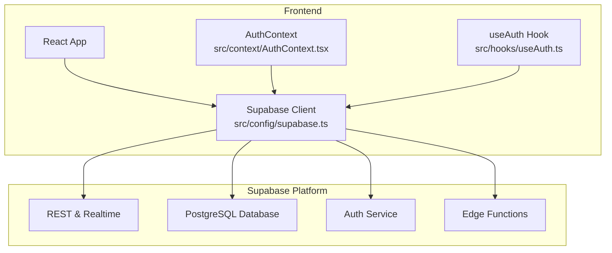
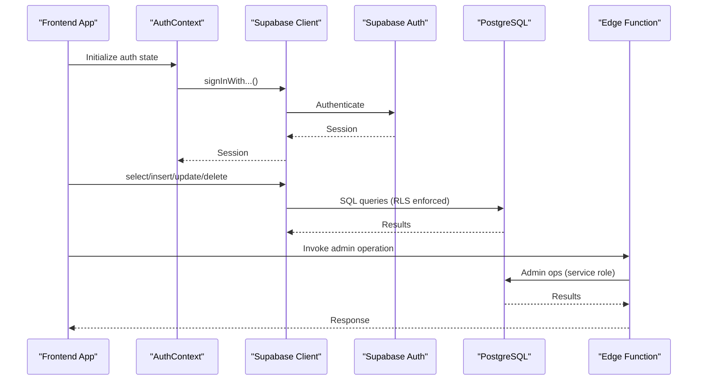
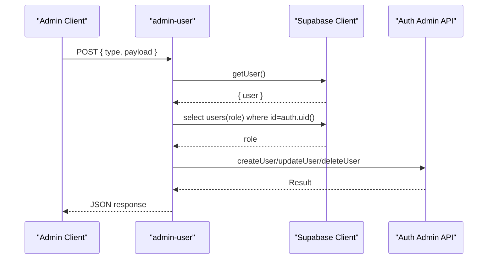
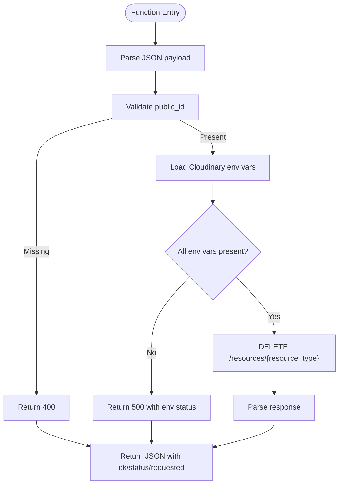
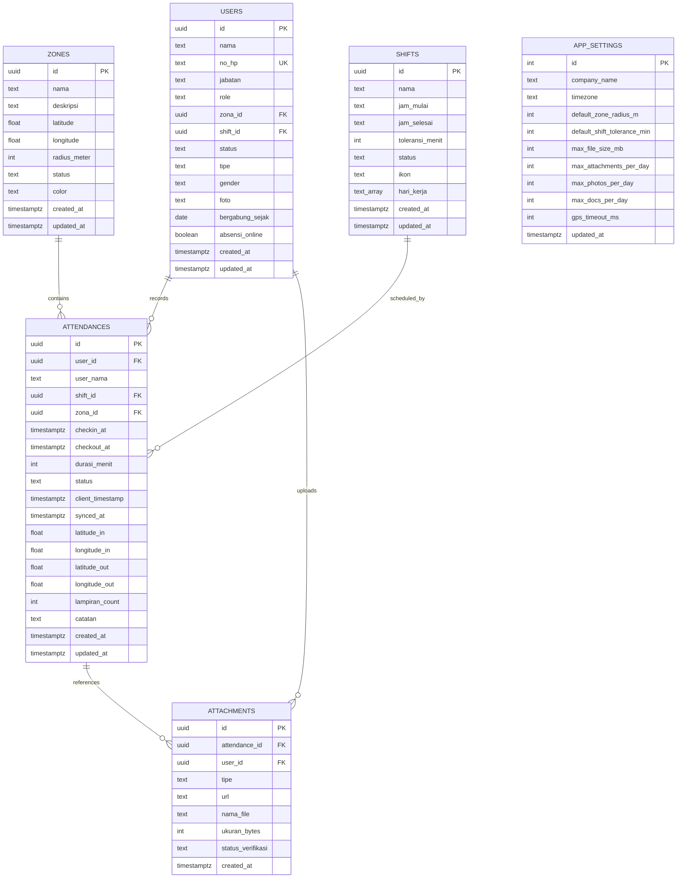
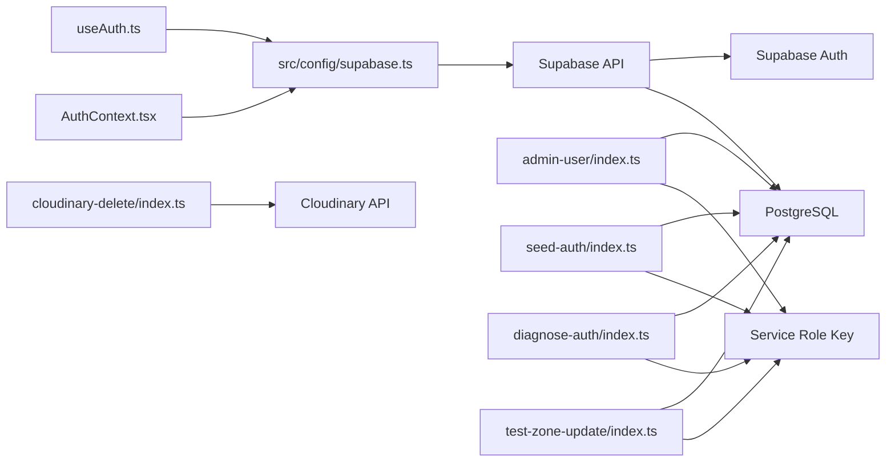

# Supabase Integration

<cite>
**Referenced Files in This Document**
- [supabase.ts](file://src/config/supabase.ts)
- [AuthContext.tsx](file://src/context/AuthContext.tsx)
- [useAuth.ts](file://src/hooks/useAuth.ts)
- [config.toml](file://supabase/config.toml)
- [admin-user/index.ts](file://supabase/functions/admin-user/index.ts)
- [cloudinary-delete/index.ts](file://supabase/functions/cloudinary-delete/index.ts)
- [diagnose-auth/index.ts](file://supabase/functions/diagnose-auth/index.ts)
- [seed-auth/index.ts](file://supabase/functions/seed-auth/index.ts)
- [test-zone-update/index.ts](file://supabase/functions/test-zone-update/index.ts)
- [001_initial.sql](file://supabase/migrations/001_initial.sql)
- [002_seed_auth.sql](file://supabase/migrations/002_seed_auth.sql)
- [003_get_user_by_no_hp.sql](file://supabase/migrations/003_get_user_by_no_hp.sql)
- [004_fix_auth_passwords.sql](file://supabase/migrations/004_fix_auth_passwords.sql)
- [005_cleanup_auth.sql](file://supabase/migrations/005_cleanup_auth.sql)
- [006_fix_rls_recursion.sql](file://supabase/migrations/006_fix_rls_recursion.sql)
- [007_add_attachments_delete_rls.sql](file://supabase/migrations/007_add_attachments_delete_rls.sql)
- [008_remediation.sql](file://supabase/migrations/008_remediation.sql)
- [009_app_settings.sql](file://supabase/migrations/009_app_settings.sql)
</cite>

## Table of Contents
1. [Introduction](#introduction)
2. [Project Structure](#project-structure)
3. [Core Components](#core-components)
4. [Architecture Overview](#architecture-overview)
5. [Detailed Component Analysis](#detailed-component-analysis)
6. [Dependency Analysis](#dependency-analysis)
7. [Performance Considerations](#performance-considerations)
8. [Troubleshooting Guide](#troubleshooting-guide)
9. [Conclusion](#conclusion)
10. [Appendices](#appendices)

## Introduction
This document explains how AbsensiOnline integrates with Supabase. It covers client configuration, authentication setup, edge functions, database schema and RLS policies, migration-driven schema evolution, and operational guidance for security and performance.

## Project Structure
Supabase-related assets are organized under the supabase directory, with three primary areas:
- Functions: Edge runtime handlers for administrative tasks, diagnostics, and integrations
- Migrations: Versioned SQL scripts that evolve the database schema and data
- Config: Local development server configuration

Key frontend integration is centralized in a single Supabase client initializer.

**Diagram sources**
- [supabase.ts:1-7](file://src/config/supabase.ts#L1-L7)
- [AuthContext.tsx](file://src/context/AuthContext.tsx)
- [useAuth.ts](file://src/hooks/useAuth.ts)
- [config.toml:1-43](file://supabase/config.toml#L1-L43)

**Section sources**
- [supabase.ts:1-7](file://src/config/supabase.ts#L1-L7)
- [config.toml:1-43](file://supabase/config.toml#L1-L43)

## Core Components
- Supabase client initialization: Creates a client instance using Vite environment variables for URL and anonymous key.
- Authentication context and hooks: Manage session state and expose auth helpers to the UI.
- Edge functions: Provide privileged operations using the service role key and enforce authorization checks.
- Database schema and RLS: Define tables, constraints, triggers, functions, and row-level security policies.

**Section sources**
- [supabase.ts:1-7](file://src/config/supabase.ts#L1-L7)
- [AuthContext.tsx](file://src/context/AuthContext.tsx)
- [useAuth.ts](file://src/hooks/useAuth.ts)
- [admin-user/index.ts:1-167](file://supabase/functions/admin-user/index.ts#L1-L167)
- [001_initial.sql:1-303](file://supabase/migrations/001_initial.sql#L1-L303)

## Architecture Overview
The frontend authenticates users against Supabase Auth, then reads/writes data through Supabase SQL and Realtime. Administrative operations are performed via edge functions that use the service role key to bypass RLS and perform privileged actions.

**Diagram sources**
- [supabase.ts:1-7](file://src/config/supabase.ts#L1-L7)
- [admin-user/index.ts:1-167](file://supabase/functions/admin-user/index.ts#L1-L167)
- [001_initial.sql:163-267](file://supabase/migrations/001_initial.sql#L163-L267)

## Detailed Component Analysis

### Supabase Client Configuration
- Initialization: Uses Vite environment variables for Supabase URL and anonymous key.
- No explicit connection pooling configuration is present in the client code; defaults apply.
- Realtime subscriptions are supported by the client but are not shown in the referenced files.

Implementation notes:
- Environment variables are consumed at build/runtime by Vite.
- The client is intended for browser environments and does not configure backend connection pools.

**Section sources**
- [supabase.ts:1-7](file://src/config/supabase.ts#L1-L7)

### Authentication Setup
- Auth server configuration enables local development with site URL and redirect settings.
- Email confirmations are disabled; signup is disabled; refresh tokens are rotated.
- Seed and remediation migrations handle bcrypt hashing and metadata consistency.

Key behaviors:
- JWT expiry and refresh rotation improve session security.
- The seed function creates users with deterministic IDs and metadata.
- A helper function retrieves user data by phone number while bypassing RLS.

**Section sources**
- [config.toml:24-36](file://supabase/config.toml#L24-L36)
- [002_seed_auth.sql:1-29](file://supabase/migrations/002_seed_auth.sql#L1-L29)
- [003_get_user_by_no_hp.sql:1-31](file://supabase/migrations/003_get_user_by_no_hp.sql#L1-L31)
- [004_fix_auth_passwords.sql:1-47](file://supabase/migrations/004_fix_auth_passwords.sql#L1-L47)
- [005_cleanup_auth.sql:1-9](file://supabase/migrations/005_cleanup_auth.sql#L1-L9)

### Edge Functions

#### admin-user
Purpose:
- Create, reset PIN, and delete users via the Supabase Auth admin API.
- Enforces admin-only access using the caller’s role from the users table.

Authorization flow:
- Validates Authorization header and fetches the current user.
- Checks the caller’s role to ensure admin or super_admin.
- Uses the service role key to perform privileged operations.

Operational flow:
- Create: Generates an email from phone number, creates auth user, and returns the new auth user ID.
- Reset password: Updates a user’s password with validation rules.
- Delete: Removes a user account.

**Diagram sources**
- [admin-user/index.ts:1-167](file://supabase/functions/admin-user/index.ts#L1-L167)

**Section sources**
- [admin-user/index.ts:1-167](file://supabase/functions/admin-user/index.ts#L1-L167)

#### cloudinary-delete
Purpose:
- Delete media resources from Cloudinary using Basic Auth with API credentials.

Behavior:
- Expects a JSON payload with public_id and optional resource_type.
- Reads Cloudinary credentials from environment variables.
- Sends a DELETE request to Cloudinary’s resources endpoint and returns the response.

**Diagram sources**
- [cloudinary-delete/index.ts:1-71](file://supabase/functions/cloudinary-delete/index.ts#L1-L71)

**Section sources**
- [cloudinary-delete/index.ts:1-71](file://supabase/functions/cloudinary-delete/index.ts#L1-L71)

#### diagnose-auth
Purpose:
- Diagnose mismatches between Supabase Auth users and public users.
- Detect orphan attendance records not linked to existing public users.

Behavior:
- Lists internal users with domain-specific emails.
- Queries public users by predefined phone numbers.
- Compares IDs and reports mismatches.
- Finds attendance records whose user_id is not present in public users.

**Section sources**
- [diagnose-auth/index.ts:1-74](file://supabase/functions/diagnose-auth/index.ts#L1-L74)

#### seed-auth
Purpose:
- Seed development data by creating or replacing specific users with fixed IDs.

Behavior:
- Deletes existing users with target emails.
- Creates users with matching UUIDs, passwords, and metadata.
- Returns a summary of results.

**Section sources**
- [seed-auth/index.ts:1-65](file://supabase/functions/seed-auth/index.ts#L1-L65)

#### test-zone-update
Purpose:
- Validate write/read/update cycles on the zones table using the service role.

Behavior:
- Selects a zone, increments latitude, updates, re-reads, and restores original value.
- Returns diagnostic info about the operation.

**Section sources**
- [test-zone-update/index.ts:1-68](file://supabase/functions/test-zone-update/index.ts#L1-L68)

### Database Schema and RLS Policies
Tables and relationships:
- zones, shifts, users, attendances, attachments, app_settings
- Constraints and indexes optimize common queries
- Triggers update timestamps automatically

RLS policies:
- Enable RLS on all core tables
- Fine-grained permissions per role and ownership
- Recursive policy fixes prevent infinite loops by using JWT claims instead of subqueries

Additional mechanisms:
- Function to derive attendance status from check-in time and shift schedule
- Unique constraint to prevent multiple check-ins per user per day in Jakarta timezone
- Singleton app_settings table with RLS for configuration

**Diagram sources**
- [001_initial.sql:11-113](file://supabase/migrations/001_initial.sql#L11-L113)
- [009_app_settings.sql:5-17](file://supabase/migrations/009_app_settings.sql#L5-L17)

**Section sources**
- [001_initial.sql:1-303](file://supabase/migrations/001_initial.sql#L1-L303)
- [006_fix_rls_recursion.sql:1-78](file://supabase/migrations/006_fix_rls_recursion.sql#L1-L78)
- [008_remediation.sql:1-35](file://supabase/migrations/008_remediation.sql#L1-L35)
- [009_app_settings.sql:1-46](file://supabase/migrations/009_app_settings.sql#L1-L46)

### Migration System
The migration system evolves schema and data in order:
- 001_initial.sql: Base schema, constraints, indexes, triggers, and initial RLS policies
- 002_seed_auth.sql: Seeds auth.users with bcrypt hashes
- 003_get_user_by_no_hp.sql: Security definer function for login helper
- 004_fix_auth_passwords.sql: Ensures pgcrypto extension and recreates users with correct hashes
- 005_cleanup_auth.sql: Emergency cleanup of broken users
- 006_fix_rls_recursion.sql: Fixes recursive RLS policies using JWT claims
- 007_add_attachments_delete_rls.sql: Adds DELETE policy for attachments
- 008_remediation.sql: Attendance status derivation and daily check-in uniqueness
- 009_app_settings.sql: Singleton settings table with RLS

Best practices:
- Keep migrations idempotent and ordered
- Use security definer functions carefully and limit scope
- Test RLS policies after changes

**Section sources**
- [001_initial.sql:1-303](file://supabase/migrations/001_initial.sql#L1-L303)
- [002_seed_auth.sql:1-29](file://supabase/migrations/002_seed_auth.sql#L1-L29)
- [003_get_user_by_no_hp.sql:1-31](file://supabase/migrations/003_get_user_by_no_hp.sql#L1-L31)
- [004_fix_auth_passwords.sql:1-47](file://supabase/migrations/004_fix_auth_passwords.sql#L1-L47)
- [005_cleanup_auth.sql:1-9](file://supabase/migrations/005_cleanup_auth.sql#L1-L9)
- [006_fix_rls_recursion.sql:1-78](file://supabase/migrations/006_fix_rls_recursion.sql#L1-L78)
- [007_add_attachments_delete_rls.sql:1-7](file://supabase/migrations/007_add_attachments_delete_rls.sql#L1-L7)
- [008_remediation.sql:1-35](file://supabase/migrations/008_remediation.sql#L1-L35)
- [009_app_settings.sql:1-46](file://supabase/migrations/009_app_settings.sql#L1-L46)

## Dependency Analysis
- Frontend depends on the Supabase client initialized in a single module.
- Edge functions depend on Supabase service role keys and environment variables.
- Database policies depend on JWT claims and user metadata stored in auth and public tables.

**Diagram sources**
- [supabase.ts:1-7](file://src/config/supabase.ts#L1-L7)
- [admin-user/index.ts:1-167](file://supabase/functions/admin-user/index.ts#L1-L167)
- [seed-auth/index.ts:1-65](file://supabase/functions/seed-auth/index.ts#L1-L65)
- [diagnose-auth/index.ts:1-74](file://supabase/functions/diagnose-auth/index.ts#L1-L74)
- [test-zone-update/index.ts:1-68](file://supabase/functions/test-zone-update/index.ts#L1-L68)
- [cloudinary-delete/index.ts:1-71](file://supabase/functions/cloudinary-delete/index.ts#L1-L71)

**Section sources**
- [supabase.ts:1-7](file://src/config/supabase.ts#L1-L7)
- [admin-user/index.ts:1-167](file://supabase/functions/admin-user/index.ts#L1-L167)
- [seed-auth/index.ts:1-65](file://supabase/functions/seed-auth/index.ts#L1-L65)
- [diagnose-auth/index.ts:1-74](file://supabase/functions/diagnose-auth/index.ts#L1-L74)
- [test-zone-update/index.ts:1-68](file://supabase/functions/test-zone-update/index.ts#L1-L68)
- [cloudinary-delete/index.ts:1-71](file://supabase/functions/cloudinary-delete/index.ts#L1-L71)

## Performance Considerations
- Use indexes strategically: composite indexes on frequently filtered columns (e.g., attendances by user and check-in date).
- Minimize payload sizes for Realtime subscriptions and avoid subscribing to unnecessary tables.
- Prefer batch operations for bulk inserts/updates in edge functions.
- Cache infrequent configuration reads; app_settings is a singleton table suitable for caching.
- Monitor query plans for RLS-heavy workloads; keep policy expressions efficient.

[No sources needed since this section provides general guidance]

## Troubleshooting Guide
Common issues and resolutions:
- Unauthorized or forbidden responses from admin-user: Verify Authorization header and caller role in users table.
- Edge function errors due to missing environment variables: Ensure SUPABASE_URL, SUPABASE_SERVICE_ROLE_KEY, and Cloudinary credentials are set.
- Auth user creation failures: Run the password fix migration to install pgcrypto and recreate users.
- Infinite recursion or slow RLS: Confirm recursive policy fixes are applied; use JWT claims instead of subqueries.
- Attendance status not updating: Ensure the remediation triggers are active and derive function is available.
- Cloudinary deletion failures: Validate API credentials and resource_type values.

**Section sources**
- [admin-user/index.ts:1-167](file://supabase/functions/admin-user/index.ts#L1-L167)
- [cloudinary-delete/index.ts:1-71](file://supabase/functions/cloudinary-delete/index.ts#L1-L71)
- [004_fix_auth_passwords.sql:1-47](file://supabase/migrations/004_fix_auth_passwords.sql#L1-L47)
- [006_fix_rls_recursion.sql:1-78](file://supabase/migrations/006_fix_rls_recursion.sql#L1-L78)
- [008_remediation.sql:1-35](file://supabase/migrations/008_remediation.sql#L1-L35)

## Conclusion
AbsensiOnline integrates with Supabase through a clean client configuration, robust authentication, and a suite of edge functions for privileged operations. The database schema and RLS policies provide strong access controls, while the migration system ensures safe evolution of schema and data. Following the security and performance recommendations will help maintain a reliable and scalable system.

[No sources needed since this section summarizes without analyzing specific files]

## Appendices

### Environment Variables Reference
- Frontend client:
  - VITE_SUPABASE_URL
  - VITE_SUPABASE_ANON_KEY
- Edge functions:
  - SUPABASE_URL
  - SUPABASE_SERVICE_ROLE_KEY
  - SUPABASE_ANON_KEY (used by admin-user to proxy Authorization)
  - CLOUDINARY_CLOUD_NAME
  - CLOUDINARY_API_KEY
  - CLOUDINARY_API_SECRET

**Section sources**
- [supabase.ts:1-7](file://src/config/supabase.ts#L1-L7)
- [admin-user/index.ts:1-167](file://supabase/functions/admin-user/index.ts#L1-L167)
- [cloudinary-delete/index.ts:1-71](file://supabase/functions/cloudinary-delete/index.ts#L1-L71)