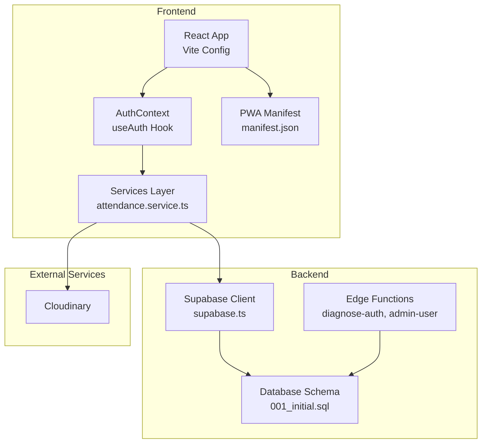
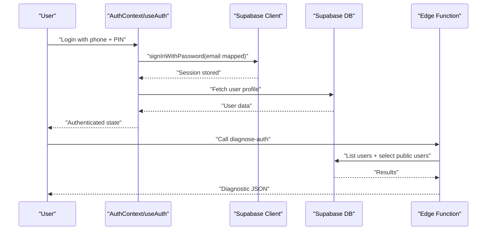
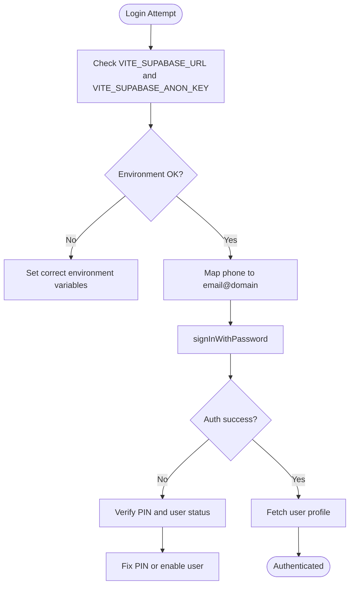
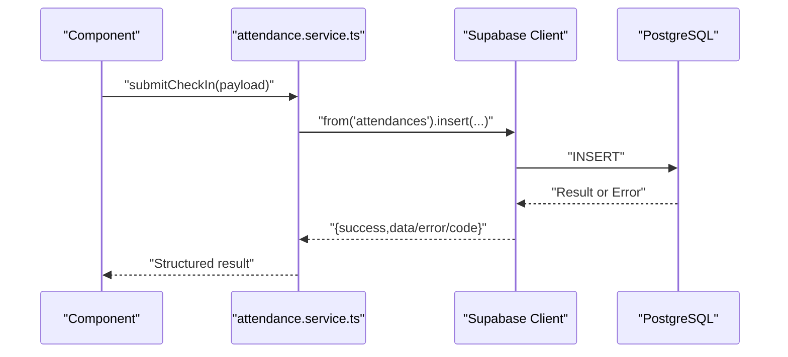
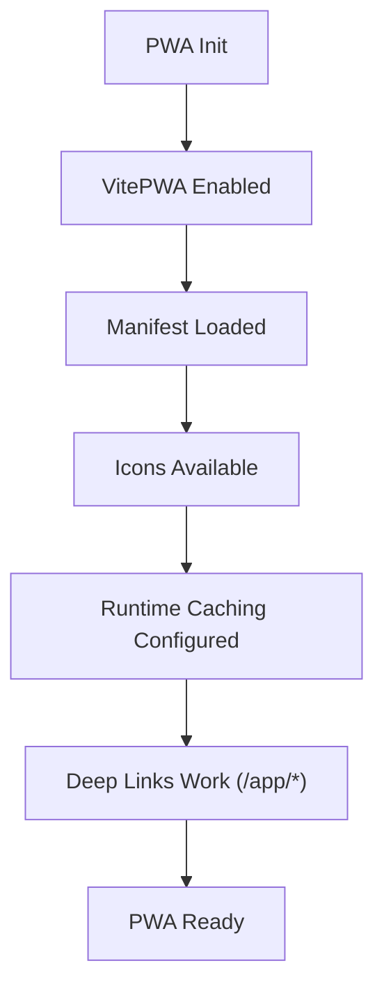
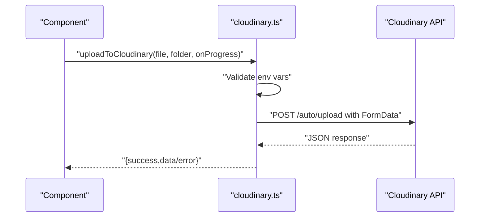
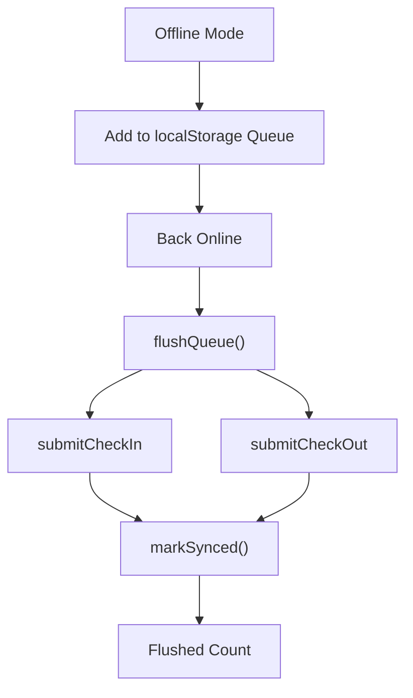
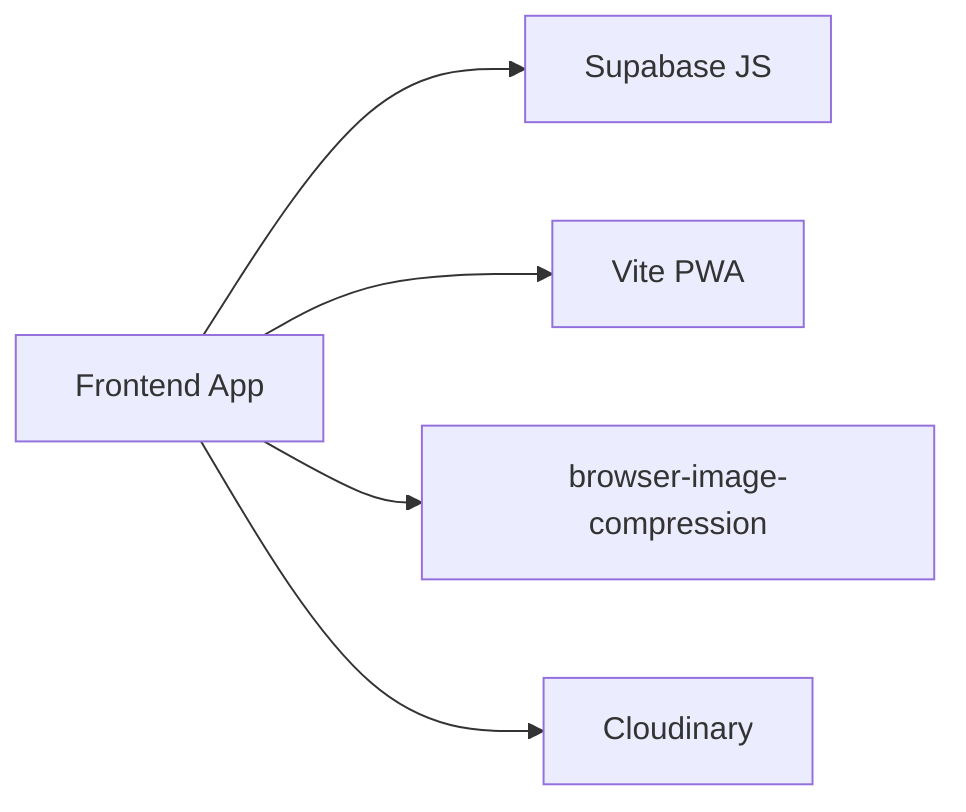

# Troubleshooting & FAQ

<cite>
**Referenced Files in This Document**
- [package.json](file://package.json)
- [vite.config.ts](file://vite.config.ts)
- [public/manifest.json](file://public/manifest.json)
- [src/config/supabase.ts](file://src/config/supabase.ts)
- [src/context/AuthContext.tsx](file://src/context/AuthContext.tsx)
- [src/hooks/useAuth.ts](file://src/hooks/useAuth.ts)
- [src/services/attendance.service.ts](file://src/services/attendance.service.ts)
- [src/utils/cloudinary.ts](file://src/utils/cloudinary.ts)
- [src/utils/offlineQueue.ts](file://src/utils/offlineQueue.ts)
- [src/types/index.ts](file://src/types/index.ts)
- [supabase/functions/diagnose-auth/index.ts](file://supabase/functions/diagnose-auth/index.ts)
- [supabase/functions/admin-user/index.ts](file://supabase/functions/admin-user/index.ts)
- [supabase/migrations/001_initial.sql](file://supabase/migrations/001_initial.sql)
- [DESIGN.md](file://DESIGN.md)
- [Cloudinary.md](file://Cloudinary.md)
</cite>

## Table of Contents
1. [Introduction](#introduction)
2. [Project Structure](#project-structure)
3. [Core Components](#core-components)
4. [Architecture Overview](#architecture-overview)
5. [Detailed Component Analysis](#detailed-component-analysis)
6. [Dependency Analysis](#dependency-analysis)
7. [Performance Considerations](#performance-considerations)
8. [Troubleshooting Guide](#troubleshooting-guide)
9. [Conclusion](#conclusion)
10. [Appendices](#appendices)

## Introduction
This document provides a comprehensive troubleshooting and FAQ guide for AbsensiOnline. It covers common issues during development, deployment, and operation phases, with targeted solutions for authentication, database connectivity, PWA functionality, and Cloudinary integration. It also includes debugging techniques for frontend components, backend services, and database queries, along with performance tips, memory leak detection strategies, error code interpretation, log analysis, and escalation procedures.

## Project Structure
AbsensiOnline is a React + Vite + TailwindCSS application with Supabase for authentication and database, and Cloudinary for media uploads. The PWA is configured via Vite PWA plugin with a service worker and manifest. Edge Functions in Supabase assist with diagnostics and administrative tasks.

**Diagram sources**
- [vite.config.ts:13-48](file://vite.config.ts#L13-L48)
- [src/context/AuthContext.tsx:18-42](file://src/context/AuthContext.tsx#L18-L42)
- [src/hooks/useAuth.ts:29-114](file://src/hooks/useAuth.ts#L29-L114)
- [src/services/attendance.service.ts:16-188](file://src/services/attendance.service.ts#L16-L188)
- [public/manifest.json:1-13](file://public/manifest.json#L1-L13)
- [src/config/supabase.ts:3-6](file://src/config/supabase.ts#L3-L6)
- [supabase/functions/diagnose-auth/index.ts:9-74](file://supabase/functions/diagnose-auth/index.ts#L9-L74)
- [supabase/functions/admin-user/index.ts:10-167](file://supabase/functions/admin-user/index.ts#L10-L167)
- [supabase/migrations/001_initial.sql:11-303](file://supabase/migrations/001_initial.sql#L11-L303)

**Section sources**
- [vite.config.ts:13-48](file://vite.config.ts#L13-L48)
- [public/manifest.json:1-13](file://public/manifest.json#L1-L13)
- [src/config/supabase.ts:3-6](file://src/config/supabase.ts#L3-L6)
- [src/context/AuthContext.tsx:18-42](file://src/context/AuthContext.tsx#L18-L42)
- [src/hooks/useAuth.ts:29-114](file://src/hooks/useAuth.ts#L29-L114)
- [src/services/attendance.service.ts:16-188](file://src/services/attendance.service.ts#L16-L188)
- [supabase/functions/diagnose-auth/index.ts:9-74](file://supabase/functions/diagnose-auth/index.ts#L9-L74)
- [supabase/functions/admin-user/index.ts:10-167](file://supabase/functions/admin-user/index.ts#L10-L167)
- [supabase/migrations/001_initial.sql:11-303](file://supabase/migrations/001_initial.sql#L11-L303)

## Core Components
- Authentication and session management powered by Supabase Auth and exposed via a React context and hook.
- Supabase client initialization with environment variables for URL and anonymous key.
- Services layer encapsulating database operations with structured error handling.
- PWA configuration enabling offline-capable mobile-like experience.
- Cloudinary integration for unsigned uploads with progress callbacks and error handling.
- Offline queue for attendance actions to ensure data synchronization when network is restored.

**Section sources**
- [src/context/AuthContext.tsx:18-42](file://src/context/AuthContext.tsx#L18-L42)
- [src/hooks/useAuth.ts:29-114](file://src/hooks/useAuth.ts#L29-L114)
- [src/config/supabase.ts:3-6](file://src/config/supabase.ts#L3-L6)
- [src/services/attendance.service.ts:16-188](file://src/services/attendance.service.ts#L16-L188)
- [vite.config.ts:20-32](file://vite.config.ts#L20-L32)
- [public/manifest.json:1-13](file://public/manifest.json#L1-L13)
- [src/utils/cloudinary.ts:11-62](file://src/utils/cloudinary.ts#L11-L62)
- [src/utils/offlineQueue.ts:66-96](file://src/utils/offlineQueue.ts#L66-L96)

## Architecture Overview
The system follows a clean separation of concerns:
- Frontend: React components consume services that talk to Supabase.
- Backend: Supabase handles authentication, row-level security, and data persistence.
- Edge Functions: Lightweight diagnostics and administrative operations.
- Media: Cloudinary for unsigned uploads with browser-side compression.

**Diagram sources**
- [src/hooks/useAuth.ts:58-96](file://src/hooks/useAuth.ts#L58-L96)
- [src/context/AuthContext.tsx:18-42](file://src/context/AuthContext.tsx#L18-L42)
- [src/config/supabase.ts:3-6](file://src/config/supabase.ts#L3-L6)
- [supabase/functions/diagnose-auth/index.ts:22-61](file://supabase/functions/diagnose-auth/index.ts#L22-L61)

**Section sources**
- [src/hooks/useAuth.ts:58-96](file://src/hooks/useAuth.ts#L58-L96)
- [supabase/functions/diagnose-auth/index.ts:22-61](file://supabase/functions/diagnose-auth/index.ts#L22-L61)

## Detailed Component Analysis

### Authentication Troubleshooting
Common symptoms:
- Login fails with “invalid credentials” or “user not found.”
- Session not persisted or expires unexpectedly.
- Unauthorized errors after login.

Root causes and fixes:
- Ensure environment variables for Supabase URL and anonymous key are present and correct.
- Verify that the phone number is normalized to an email ending with the expected domain and that the PIN matches the backend expectations.
- Confirm Supabase Auth policies and RLS are enabled and correctly configured.
- Use the diagnostic Edge Function to compare Auth users vs. public users and detect mismatches.

**Diagram sources**
- [src/config/supabase.ts:3-6](file://src/config/supabase.ts#L3-L6)
- [src/hooks/useAuth.ts:62-96](file://src/hooks/useAuth.ts#L62-L96)
- [supabase/functions/diagnose-auth/index.ts:22-54](file://supabase/functions/diagnose-auth/index.ts#L22-L54)

**Section sources**
- [src/config/supabase.ts:3-6](file://src/config/supabase.ts#L3-L6)
- [src/hooks/useAuth.ts:62-96](file://src/hooks/useAuth.ts#L62-L96)
- [supabase/functions/diagnose-auth/index.ts:22-54](file://supabase/functions/diagnose-auth/index.ts#L22-L54)

### Database Connectivity and Queries
Common symptoms:
- Network errors or timeouts when fetching data.
- Unexpected “not found” results for legitimate records.
- Errors returned with codes like PGRST116.

Debugging steps:
- Inspect ServiceResult usage to capture error messages and codes.
- Use the attendance service to reproduce issues and log the returned error code.
- Review database triggers and policies to ensure they align with expected access patterns.

**Diagram sources**
- [src/services/attendance.service.ts:25-46](file://src/services/attendance.service.ts#L25-L46)
- [src/types/index.ts:138-141](file://src/types/index.ts#L138-L141)

**Section sources**
- [src/services/attendance.service.ts:16-112](file://src/services/attendance.service.ts#L16-L112)
- [src/types/index.ts:138-141](file://src/types/index.ts#L138-L141)
- [supabase/migrations/001_initial.sql:118-160](file://supabase/migrations/001_initial.sql#L118-L160)

### PWA Functionality Problems
Common symptoms:
- App not installing as PWA or not caching assets.
- Navigation issues under deep links (/app/*).
- Manifest not applied.

Checks and fixes:
- Confirm Vite PWA plugin is enabled with autoUpdate and proper includeAssets.
- Ensure manifest.json is served and icons are available.
- Validate start_url and display settings.
- Test in preview mode to ensure SPA history fallback works.

**Diagram sources**
- [vite.config.ts:20-32](file://vite.config.ts#L20-L32)
- [public/manifest.json:1-13](file://public/manifest.json#L1-13)

**Section sources**
- [vite.config.ts:20-32](file://vite.config.ts#L20-L32)
- [public/manifest.json:1-13](file://public/manifest.json#L1-13)

### Cloudinary Integration Failures
Common symptoms:
- Uploads fail with “Cloudinary not configured” or “network error.”
- Progress callbacks not triggered.
- Upload preset misconfiguration.

Checks and fixes:
- Ensure VITE_CLOUDINARY_CLOUD_NAME and VITE_CLOUDINARY_UPLOAD_PRESET are set.
- Use unsigned upload preset as recommended.
- Validate network connectivity and CORS settings.
- Handle XHR events for load, error, and abort.

**Diagram sources**
- [src/utils/cloudinary.ts:11-62](file://src/utils/cloudinary.ts#L11-L62)

**Section sources**
- [src/utils/cloudinary.ts:11-62](file://src/utils/cloudinary.ts#L11-L62)
- [Cloudinary.md:45-70](file://Cloudinary.md#L45-L70)

### Offline Queue and Sync Issues
Common symptoms:
- Check-in/out not syncing when offline.
- Queue not flushing after reconnect.
- Local storage corruption.

Checks and fixes:
- Ensure queue is initialized and items are added with correct types.
- Trigger flushQueue on online event.
- Clear synced items and maintain a daily local record for today’s check-in.

**Diagram sources**
- [src/utils/offlineQueue.ts:66-96](file://src/utils/offlineQueue.ts#L66-L96)
- [src/services/attendance.service.ts:25-77](file://src/services/attendance.service.ts#L25-L77)

**Section sources**
- [src/utils/offlineQueue.ts:66-96](file://src/utils/offlineQueue.ts#L66-L96)
- [src/services/attendance.service.ts:25-77](file://src/services/attendance.service.ts#L25-L77)

## Dependency Analysis
Key external dependencies and their roles:
- Supabase client for authentication, database, and realtime.
- Vite PWA plugin for service worker and manifest generation.
- Cloudinary SDK for unsigned uploads.
- Browser image compression for client-side optimization.

**Diagram sources**
- [package.json:13-39](file://package.json#L13-L39)
- [vite.config.ts:6-32](file://vite.config.ts#L6-L32)

**Section sources**
- [package.json:13-39](file://package.json#L13-L39)
- [vite.config.ts:6-32](file://vite.config.ts#L6-L32)

## Performance Considerations
- Minimize unnecessary re-renders by leveraging local cache and avoiding redundant Supabase queries.
- Debounce or throttle GPS and upload operations to reduce network overhead.
- Use browser-image-compression to reduce payload sizes before uploading to Cloudinary.
- Monitor offline queue flush frequency to balance responsiveness and network usage.
- Keep PWA runtime caching minimal and avoid caching large assets unnecessarily.

[No sources needed since this section provides general guidance]

## Troubleshooting Guide

### Authentication Problems
Symptoms:
- Login returns “invalid credentials.”
- After login, access to protected routes fails.

Steps:
- Verify environment variables for Supabase client initialization.
- Confirm the phone-to-email mapping and PIN validation logic.
- Use the diagnostic function to compare Auth users vs. public users and check for mismatches.

**Section sources**
- [src/config/supabase.ts:3-6](file://src/config/supabase.ts#L3-L6)
- [src/hooks/useAuth.ts:62-96](file://src/hooks/useAuth.ts#L62-L96)
- [supabase/functions/diagnose-auth/index.ts:22-54](file://supabase/functions/diagnose-auth/index.ts#L22-L54)

### Database Connection Issues
Symptoms:
- Network errors or timeouts.
- Errors with specific codes (e.g., PGRST116).

Steps:
- Capture ServiceResult error messages and codes.
- Reproduce with attendance service and inspect returned error code.
- Review triggers and policies in the schema.

**Section sources**
- [src/services/attendance.service.ts:16-112](file://src/services/attendance.service.ts#L16-L112)
- [src/types/index.ts:138-141](file://src/types/index.ts#L138-L141)
- [supabase/migrations/001_initial.sql:118-160](file://supabase/migrations/001_initial.sql#L118-L160)

### PWA Functionality Problems
Symptoms:
- PWA not installing or not serving cached assets.
- Deep links not working.

Steps:
- Confirm Vite PWA plugin configuration and runtime caching.
- Validate manifest.json and icons availability.
- Test preview mode for SPA routing.

**Section sources**
- [vite.config.ts:20-32](file://vite.config.ts#L20-L32)
- [public/manifest.json:1-13](file://public/manifest.json#L1-13)

### Cloudinary Integration Failures
Symptoms:
- Uploads fail with configuration or network errors.

Steps:
- Ensure VITE_CLOUDINARY_CLOUD_NAME and VITE_CLOUDINARY_UPLOAD_PRESET are set.
- Use unsigned upload preset and validate network connectivity.
- Handle XHR events and parse JSON responses.

**Section sources**
- [src/utils/cloudinary.ts:11-62](file://src/utils/cloudinary.ts#L11-L62)
- [Cloudinary.md:45-70](file://Cloudinary.md#L45-L70)

### Offline Queue and Sync Issues
Symptoms:
- Data not syncing after returning online.

Steps:
- Verify queue initialization and item types.
- Ensure flushQueue is called on online event.
- Clear synced items and maintain daily local record.

**Section sources**
- [src/utils/offlineQueue.ts:66-96](file://src/utils/offlineQueue.ts#L66-L96)
- [src/services/attendance.service.ts:25-77](file://src/services/attendance.service.ts#L25-L77)

### Debugging Techniques
Frontend:
- Use React DevTools to inspect AuthContext and hook state.
- Log ServiceResult objects to capture error messages and codes.
- Add console logs around Supabase queries and mutations.

Backend:
- Use the diagnostic Edge Function to compare Auth users and public users.
- Validate admin functions for create/reset/delete operations.

Database:
- Inspect triggers and policies for updates and RLS.
- Use RPC functions for reporting and aggregation.

**Section sources**
- [src/context/AuthContext.tsx:18-42](file://src/context/AuthContext.tsx#L18-L42)
- [src/hooks/useAuth.ts:29-114](file://src/hooks/useAuth.ts#L29-L114)
- [supabase/functions/diagnose-auth/index.ts:22-61](file://supabase/functions/diagnose-auth/index.ts#L22-L61)
- [supabase/migrations/001_initial.sql:118-160](file://supabase/migrations/001_initial.sql#L118-L160)

### Error Codes and Log Analysis
- ServiceResult structure carries success flag, error message, and optional code.
- Common PostgreSQL error codes include PGRST116 for “not found.”
- Use structured logging to capture error codes and messages for triage.

**Section sources**
- [src/types/index.ts:138-141](file://src/types/index.ts#L138-L141)
- [src/services/attendance.service.ts:96-98](file://src/services/attendance.service.ts#L96-L98)

### Memory Leak Detection and Optimization
- Avoid storing large datasets in React state; prefer paginated queries and local cache.
- Unsubscribe from Supabase auth subscriptions and cleanup event listeners.
- Limit offline queue size and periodically prune old entries.
- Defer heavy computations to Web Workers if needed.

**Section sources**
- [src/hooks/useAuth.ts:54-56](file://src/hooks/useAuth.ts#L54-L56)
- [src/utils/offlineQueue.ts:66-96](file://src/utils/offlineQueue.ts#L66-L96)

### Frequently Asked Questions
Q: How do I configure Supabase environment variables?
A: Set VITE_SUPABASE_URL and VITE_SUPABASE_ANON_KEY in your environment. These are consumed by the Supabase client initialization.

Q: Why does login require a phone number but display an email?
A: Internally, the system maps the phone number to an email with a specific domain and authenticates using Supabase Auth.

Q: How do I fix “Cloudinary not configured”?
A: Ensure VITE_CLOUDINARY_CLOUD_NAME and VITE_CLOUDINARY_UPLOAD_PRESET are set. Use an unsigned upload preset and verify network connectivity.

Q: How do I enable PWA features?
A: Confirm Vite PWA plugin is active and manifest.json is served. Validate icons and start_url.

Q: How do I reset a worker’s PIN?
A: Use the admin Edge Function to reset the user’s password with the required constraints.

**Section sources**
- [src/config/supabase.ts:3-6](file://src/config/supabase.ts#L3-L6)
- [src/hooks/useAuth.ts:74-83](file://src/hooks/useAuth.ts#L74-L83)
- [src/utils/cloudinary.ts:19-21](file://src/utils/cloudinary.ts#L19-L21)
- [vite.config.ts:20-32](file://vite.config.ts#L20-L32)
- [supabase/functions/admin-user/index.ts:96-127](file://supabase/functions/admin-user/index.ts#L96-L127)

### Escalation Procedures and Support Resources
Escalation:
- For authentication mismatches, run the diagnostic function and share the results.
- For database anomalies, review triggers, policies, and RPC functions.
- For PWA issues, validate plugin configuration and manifest.

Support resources:
- Supabase documentation and community forums.
- Cloudinary documentation and support.
- Vite and React community channels.

**Section sources**
- [supabase/functions/diagnose-auth/index.ts:63-72](file://supabase/functions/diagnose-auth/index.ts#L63-L72)
- [supabase/migrations/001_initial.sql:163-267](file://supabase/migrations/001_initial.sql#L163-L267)
- [Cloudinary.md:45-70](file://Cloudinary.md#L45-L70)

## Conclusion
This guide consolidates actionable troubleshooting steps for AbsensiOnline across authentication, database, PWA, and Cloudinary. By following the diagnostic flows, validating configurations, and applying the performance and memory optimization strategies outlined here, most issues can be resolved quickly and efficiently.

[No sources needed since this section summarizes without analyzing specific files]

## Appendices

### Appendix A: Environment Variables Reference
- VITE_SUPABASE_URL: Supabase project URL.
- VITE_SUPABASE_ANON_KEY: Supabase anonymous API key.
- VITE_CLOUDINARY_CLOUD_NAME: Cloudinary cloud name.
- VITE_CLOUDINARY_UPLOAD_PRESET: Cloudinary unsigned upload preset.

**Section sources**
- [src/config/supabase.ts:3-6](file://src/config/supabase.ts#L3-L6)
- [src/utils/cloudinary.ts:16-17](file://src/utils/cloudinary.ts#L16-L17)