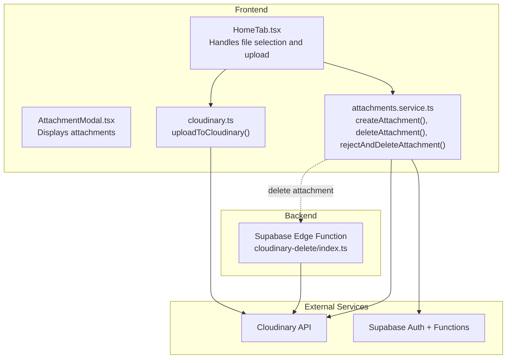
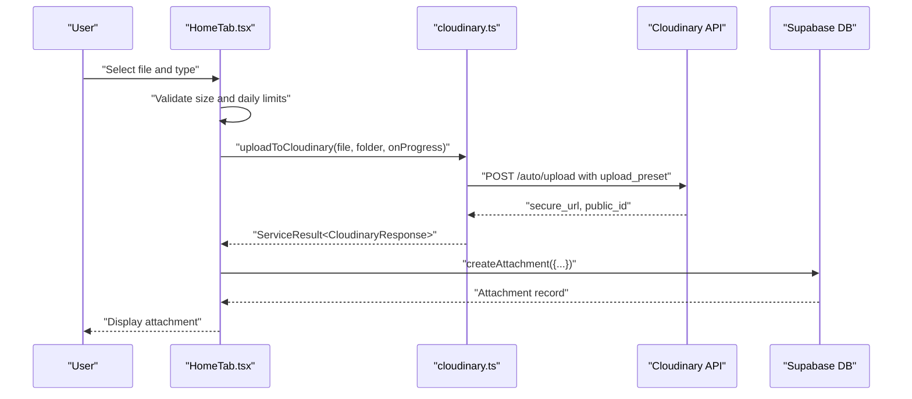
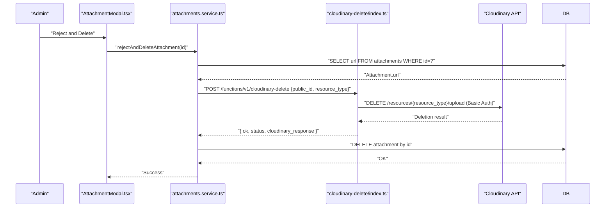
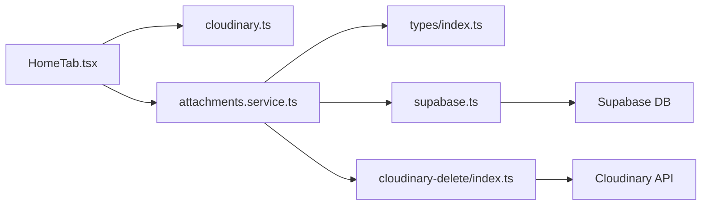

# Cloudinary Integration

<cite>
**Referenced Files in This Document**
- [cloudinary.ts](file://src/utils/cloudinary.ts)
- [attachments.service.ts](file://src/services/attachments.service.ts)
- [HomeTab.tsx](file://src/components/pwa/HomeTab.tsx)
- [AttachmentModal.tsx](file://src/components/admin/AttachmentModal.tsx)
- [index.ts](file://supabase/functions/cloudinary-delete/index.ts)
- [supabase.ts](file://src/config/supabase.ts)
- [settings.service.ts](file://src/services/settings.service.ts)
- [index.ts](file://src/types/index.ts)
</cite>

## Table of Contents
1. [Introduction](#introduction)
2. [Project Structure](#project-structure)
3. [Core Components](#core-components)
4. [Architecture Overview](#architecture-overview)
5. [Detailed Component Analysis](#detailed-component-analysis)
6. [Dependency Analysis](#dependency-analysis)
7. [Performance Considerations](#performance-considerations)
8. [Security Best Practices](#security-best-practices)
9. [Troubleshooting Guide](#troubleshooting-guide)
10. [Conclusion](#conclusion)

## Introduction
This document explains the Cloudinary integration in AbsensiOnline, focusing on the frontend image upload process, backend deletion flow, and supporting services. It covers configuration, authentication setup, upload presets, security controls, error handling, performance tuning, and CDN delivery patterns. The integration leverages Supabase Edge Functions for server-side Cloudinary deletions, ensuring safe removal of resources while maintaining access control via Supabase authentication.

## Project Structure
Cloudinary-related functionality spans three areas:
- Frontend utilities for uploading images to Cloudinary
- Supabase Edge Function for deleting Cloudinary resources
- Application services that orchestrate uploads, storage, and verification

**Diagram sources**
- [HomeTab.tsx:412-491](file://src/components/pwa/HomeTab.tsx#L412-L491)
- [cloudinary.ts:11-62](file://src/utils/cloudinary.ts#L11-L62)
- [attachments.service.ts:68-110](file://src/services/attachments.service.ts#L68-L110)
- [index.ts:1-71](file://supabase/functions/cloudinary-delete/index.ts#L1-L71)

**Section sources**
- [HomeTab.tsx:1-200](file://src/components/pwa/HomeTab.tsx#L1-L200)
- [cloudinary.ts:1-63](file://src/utils/cloudinary.ts#L1-L63)
- [attachments.service.ts:1-127](file://src/services/attachments.service.ts#L1-L127)
- [index.ts:1-71](file://supabase/functions/cloudinary-delete/index.ts#L1-L71)

## Core Components
- uploadToCloudinary: Frontend function that uploads files to Cloudinary using a configured upload preset and tracks progress.
- Supabase Edge Function cloudinary-delete: Backend endpoint that deletes Cloudinary resources using Basic Auth with API credentials.
- attachments.service: Orchestrates creation, verification, and deletion of attachment records and coordinates Cloudinary cleanup.
- HomeTab.tsx: Implements the user flow for selecting, validating, compressing, uploading, and storing attachments.
- AttachmentModal.tsx: Renders attachments and supports download and rejection actions.

Key types and constants:
- ServiceResult<T>: Standardized return type for service methods.
- Attachment: Attachment entity persisted in Supabase with Cloudinary URL and metadata.

**Section sources**
- [cloudinary.ts:11-62](file://src/utils/cloudinary.ts#L11-L62)
- [index.ts:137-141](file://src/types/index.ts#L137-L141)
- [index.ts:48-58](file://src/types/index.ts#L48-L58)
- [attachments.service.ts:68-110](file://src/services/attachments.service.ts#L68-L110)
- [HomeTab.tsx:412-491](file://src/components/pwa/HomeTab.tsx#L412-L491)

## Architecture Overview
The upload and delete flows are illustrated below.

**Diagram sources**
- [HomeTab.tsx:412-491](file://src/components/pwa/HomeTab.tsx#L412-L491)
- [cloudinary.ts:11-62](file://src/utils/cloudinary.ts#L11-L62)
- [attachments.service.ts:68-75](file://src/services/attachments.service.ts#L68-L75)

**Diagram sources**
- [AttachmentModal.tsx:124-133](file://src/components/admin/AttachmentModal.tsx#L124-L133)
- [attachments.service.ts:96-110](file://src/services/attachments.service.ts#L96-L110)
- [index.ts:1-71](file://supabase/functions/cloudinary-delete/index.ts#L1-L71)

## Detailed Component Analysis

### Frontend Upload Utility: uploadToCloudinary
Purpose:
- Upload a File to Cloudinary using a predefined upload preset.
- Append folder path under a structured hierarchy.
- Report upload progress via callback.
- Return standardized ServiceResult with CloudinaryResponse on success.

Parameters:
- file: File to upload
- folder: Target folder path appended to base prefix
- onProgress?: Optional progress callback receiving percentage

Behavior:
- Reads VITE_CLOUDINARY_CLOUD_NAME and VITE_CLOUDINARY_UPLOAD_PRESET from environment.
- Validates presence of required configuration.
- Constructs FormData with file, upload_preset, and folder.
- Sends XMLHttpRequest to Cloudinary auto/upload endpoint.
- Parses response and resolves with success or error.

Error handling:
- Returns error if environment variables are missing.
- Catches parsing errors and network failures.
- Distinguishes HTTP statuses and Cloudinary error messages.

CDN delivery:
- Secure URL returned by Cloudinary is stored in the Attachment record.

**Section sources**
- [cloudinary.ts:11-62](file://src/utils/cloudinary.ts#L11-L62)

### Frontend Upload Flow in HomeTab
Responsibilities:
- Enforces file size and daily limits from app settings.
- Compresses photos using browser-image-compression before upload.
- Calls uploadToCloudinary with progress updates.
- Persists attachment metadata to Supabase and increments attachment count.

Processing logic:
- Calculates maxima from settings and compares against current attachments.
- Uses imageCompression for photos with configurable thresholds.
- On success, creates Attachment record with secure_url and metadata.
- Updates local state and database counters.

**Section sources**
- [HomeTab.tsx:412-491](file://src/components/pwa/HomeTab.tsx#L412-L491)
- [settings.service.ts:5-14](file://src/services/settings.service.ts#L5-L14)

### Attachment Management Service
Responsibilities:
- Retrieve attachments by attendance or user.
- Create attachment records.
- Delete attachment records.
- Update verification status.
- Reject and delete: fetch URL, call Cloudinary delete via Supabase Function, then delete DB record.

Deletion coordination:
- Extracts public_id and resource_type from Cloudinary URL.
- Requires active Supabase session for authorization.
- Calls Supabase Function with Bearer token and apikey header.
- Parses function response and returns standardized ServiceResult.

**Section sources**
- [attachments.service.ts:48-127](file://src/services/attachments.service.ts#L48-L127)

### Cloudinary Delete Function (Supabase Edge Function)
Responsibilities:
- Accepts JSON payload with public_id and optional resource_type.
- Validates presence of Cloudinary environment variables.
- Performs DELETE against Cloudinary resources endpoint using Basic Auth.
- Returns structured response including ok, status, and raw Cloudinary response.

Security:
- Uses Basic Auth with CLOUDINARY_API_KEY and CLOUDINARY_API_SECRET.
- Exposes CORS headers for Function invocation.
- Requires caller to supply Bearer token and apikey for Supabase authorization.

**Section sources**
- [index.ts:1-71](file://supabase/functions/cloudinary-delete/index.ts#L1-L71)

### Attachment Display and Actions
Responsibilities:
- Render list of attachments with metadata and verification status.
- Support download and preview actions.
- Trigger rejection and deletion confirmation flow.

Integration:
- Uses AttachmentModal to present actions.
- Deletion triggers rejectAndDeleteAttachment in service layer.

**Section sources**
- [AttachmentModal.tsx:24-137](file://src/components/admin/AttachmentModal.tsx#L24-L137)

## Dependency Analysis
High-level dependencies:
- HomeTab depends on cloudinary.ts for upload and attachments.service for persistence.
- attachments.service depends on Supabase client and the Supabase Function for deletion.
- Supabase Function depends on Cloudinary API and environment variables.
- Types define shared structures used across services and components.

**Diagram sources**
- [HomeTab.tsx:1-24](file://src/components/pwa/HomeTab.tsx#L1-L24)
- [cloudinary.ts:1-1](file://src/utils/cloudinary.ts#L1-L1)
- [attachments.service.ts:1-2](file://src/services/attachments.service.ts#L1-L2)
- [supabase.ts:1-7](file://src/config/supabase.ts#L1-L7)
- [index.ts:1-71](file://supabase/functions/cloudinary-delete/index.ts#L1-L71)
- [index.ts:48-58](file://src/types/index.ts#L48-L58)

**Section sources**
- [HomeTab.tsx:1-24](file://src/components/pwa/HomeTab.tsx#L1-L24)
- [cloudinary.ts:1-1](file://src/utils/cloudinary.ts#L1-L1)
- [attachments.service.ts:1-2](file://src/services/attachments.service.ts#L1-L2)
- [supabase.ts:1-7](file://src/config/supabase.ts#L1-L7)
- [index.ts:1-71](file://supabase/functions/cloudinary-delete/index.ts#L1-L71)
- [index.ts:48-58](file://src/types/index.ts#L48-L58)

## Performance Considerations
- Image compression: Photos are compressed before upload to reduce bandwidth and storage costs. The compression uses a maximum size and dimension threshold with progress reporting.
- Progress tracking: Upload progress is split between compression and upload phases to provide accurate feedback.
- CDN delivery: Secure URLs from Cloudinary are used directly for fast global delivery.
- Limits enforcement: Daily and per-type limits prevent excessive resource consumption and maintain system responsiveness.

Recommendations:
- Consider enabling Cloudinary transformations (auto format and quality) at retrieval time for further optimization.
- Monitor Cloudinary usage quotas and adjust compression parameters based on observed file sizes and quality metrics.

**Section sources**
- [HomeTab.tsx:434-448](file://src/components/pwa/HomeTab.tsx#L434-L448)
- [HomeTab.tsx:451-453](file://src/components/pwa/HomeTab.tsx#L451-L453)

## Security Best Practices
- Environment configuration: Cloudinary credentials are read from environment variables. The integration checks for required variables and returns a descriptive error if missing.
- Access control: Deletion requests require a valid Supabase session. The service fetches the session and passes the Bearer token to the Function.
- Signed vs unsigned uploads: The current implementation uses an upload preset, which is convenient but less secure than signed uploads. For production, consider signed uploads with server-side signature generation to restrict allowed transformations and folders.
- CORS and headers: The Function exposes appropriate CORS headers and validates incoming JSON payload.
- Least privilege: The Function uses Basic Auth with API credentials and only performs deletion operations.

**Section sources**
- [cloudinary.ts:16-21](file://src/utils/cloudinary.ts#L16-L21)
- [attachments.service.ts:24-38](file://src/services/attachments.service.ts#L24-L38)
- [index.ts:3-6](file://supabase/functions/cloudinary-delete/index.ts#L3-L6)
- [index.ts:23-37](file://supabase/functions/cloudinary-delete/index.ts#L23-L37)

## Troubleshooting Guide
Common issues and resolutions:
- Missing Cloudinary configuration: If VITE_CLOUDINARY_CLOUD_NAME or VITE_CLOUDINARY_UPLOAD_PRESET is not set, the upload function returns an error indicating missing configuration. Ensure environment variables are present and reload the app.
- Upload failures: Network errors or Cloudinary API errors are surfaced with descriptive messages. Check connectivity and Cloudinary dashboard for quota or policy violations.
- Deletion failures: The Function validates environment variables and returns structured errors if keys are missing. Verify CLOUDINARY_CLOUD_NAME, CLOUDINARY_API_KEY, and CLOUDINARY_API_SECRET are set in the Supabase Function environment.
- Authentication errors: Rejection and deletion requires an active session. Ensure the user is logged in and the session token is valid.
- URL parsing errors: The service extracts public_id and resource_type from the Cloudinary URL. Invalid URLs will cause extraction to fail.

Operational tips:
- Use the integration status checker to verify Supabase and Cloudinary configuration availability.
- Monitor Cloudinary logs and Supabase Function logs for detailed error traces.

**Section sources**
- [cloudinary.ts:19-21](file://src/utils/cloudinary.ts#L19-L21)
- [cloudinary.ts:47-54](file://src/utils/cloudinary.ts#L47-L54)
- [index.ts:16-21](file://supabase/functions/cloudinary-delete/index.ts#L16-L21)
- [index.ts:27-37](file://supabase/functions/cloudinary-delete/index.ts#L27-L37)
- [attachments.service.ts:20-25](file://src/services/attachments.service.ts#L20-L25)
- [settings.service.ts:29-34](file://src/services/settings.service.ts#L29-L34)

## Conclusion
AbsensiOnline’s Cloudinary integration combines a straightforward upload preset approach on the frontend with a secure backend deletion mechanism powered by Supabase Edge Functions. The system enforces sensible limits, provides progress feedback, and stores attachment metadata alongside Cloudinary URLs for efficient CDN delivery. For enhanced security, consider adopting signed uploads and stricter access policies aligned with your operational requirements.