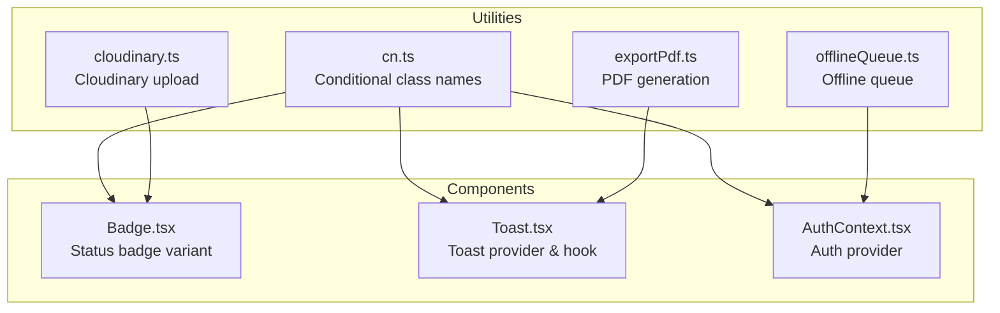
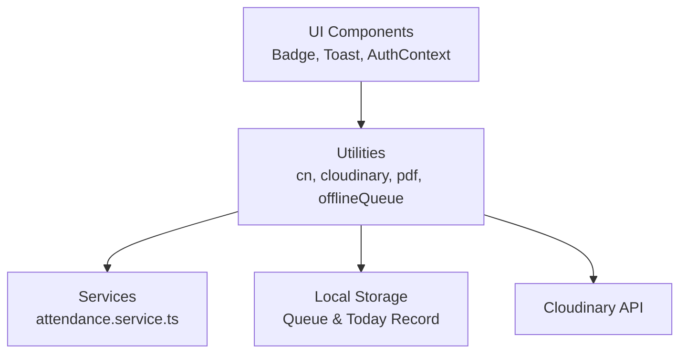
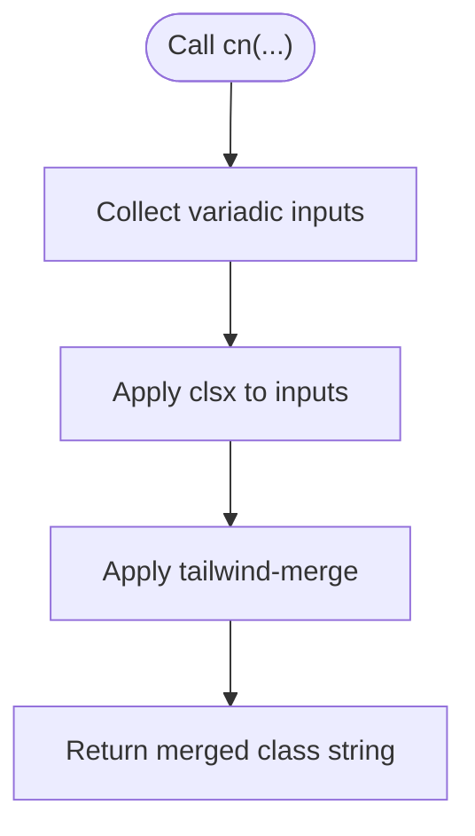
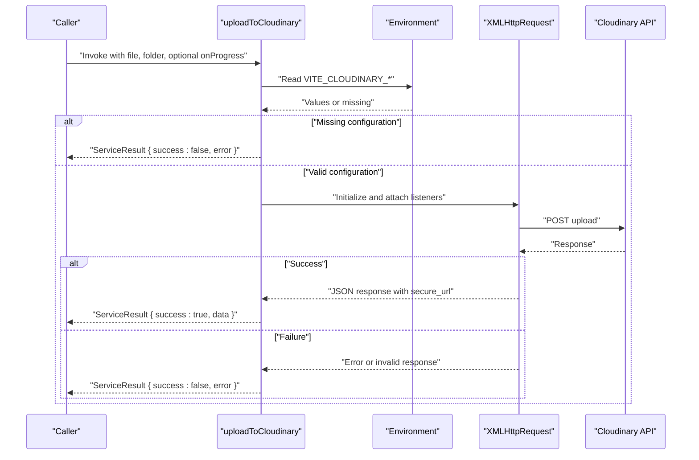
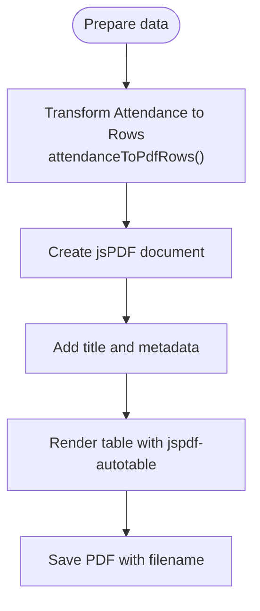
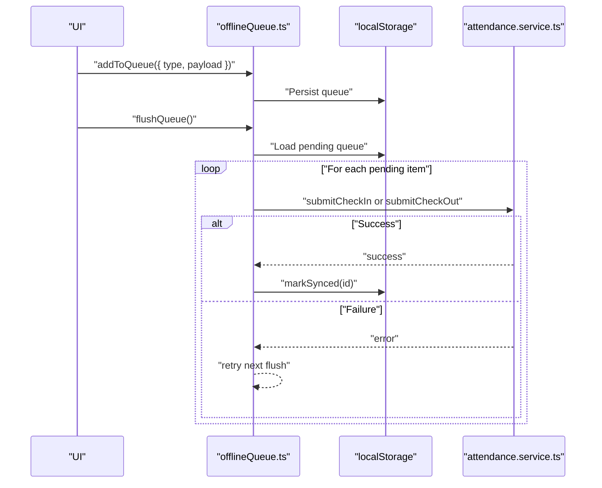
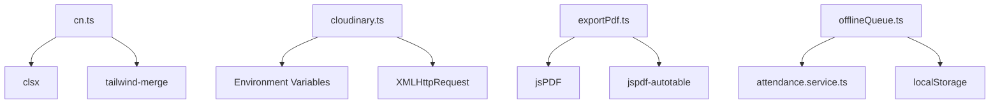

# Helper Utilities

<cite>
**Referenced Files in This Document**
- [cn.ts](file://src/utils/cn.ts)
- [cloudinary.ts](file://src/utils/cloudinary.ts)
- [exportPdf.ts](file://src/utils/exportPdf.ts)
- [offlineQueue.ts](file://src/utils/offlineQueue.ts)
- [Badge.tsx](file://src/components/ui/Badge.tsx)
- [Toast.tsx](file://src/components/ui/Toast.tsx)
- [AuthContext.tsx](file://src/context/AuthContext.tsx)
- [index.ts](file://src/types/index.ts)
</cite>

## Table of Contents
1. [Introduction](#introduction)
2. [Project Structure](#project-structure)
3. [Core Components](#core-components)
4. [Architecture Overview](#architecture-overview)
5. [Detailed Component Analysis](#detailed-component-analysis)
6. [Dependency Analysis](#dependency-analysis)
7. [Performance Considerations](#performance-considerations)
8. [Troubleshooting Guide](#troubleshooting-guide)
9. [Conclusion](#conclusion)

## Introduction
This document focuses on the helper utility functions in AbsensiOnline, with special emphasis on the cn function for conditional class name concatenation. It explains the utility patterns used across the application for string manipulation, object handling, and common operations. The guide details function signatures, parameter handling, return value formats, and demonstrates usage patterns such as conditional styling, object property access, and data transformation. Best practices for extending utilities and maintaining consistency are included, along with performance considerations and optimization opportunities.

## Project Structure
The utilities are located under the src/utils directory and are consumed by components, services, and shared logic across the application. The key files documented here are:
- cn.ts: Provides the cn function for merging Tailwind CSS classes with conditional logic.
- cloudinary.ts: Handles image uploads to Cloudinary with progress callbacks and error handling.
- exportPdf.ts: Generates PDF reports for monthly attendance and daily attendance records.
- offlineQueue.ts: Manages offline actions (check-in/check-out) using local storage and retries.

**Diagram sources**
- [cn.ts](file://src/utils/cn.ts)
- [cloudinary.ts](file://src/utils/cloudinary.ts)
- [exportPdf.ts](file://src/utils/exportPdf.ts)
- [offlineQueue.ts](file://src/utils/offlineQueue.ts)
- [Badge.tsx](file://src/components/ui/Badge.tsx)
- [Toast.tsx](file://src/components/ui/Toast.tsx)
- [AuthContext.tsx](file://src/context/AuthContext.tsx)

**Section sources**
- [cn.ts](file://src/utils/cn.ts)
- [cloudinary.ts](file://src/utils/cloudinary.ts)
- [exportPdf.ts](file://src/utils/exportPdf.ts)
- [offlineQueue.ts](file://src/utils/offlineQueue.ts)

## Core Components
This section documents the primary utility functions and their roles in the application.

- cn: Conditional class name concatenator
  - Purpose: Merge Tailwind CSS classes while avoiding duplicates and conflicts.
  - Function signature: cn(...inputs: ClassValue[])
  - Parameters: Accepts a variadic list of class inputs compatible with clsx.
  - Returns: A merged string of class names processed by tailwind-merge.
  - Usage pattern: Combine conditional expressions, arrays, and objects to produce clean Tailwind class strings.
  - Example scenarios:
    - Conditional styling: Apply different classes based on props or state.
    - Dynamic variants: Build class lists from computed conditions.
    - Component composition: Pass computed class names to child components.

- uploadToCloudinary: Image upload helper
  - Purpose: Upload files to Cloudinary with progress reporting and robust error handling.
  - Function signature: uploadToCloudinary(file: File, folder: string, onProgress?: (percent: number) => void)
  - Parameters:
    - file: The File object to upload.
    - folder: Target folder path on Cloudinary.
    - onProgress: Optional callback receiving percentage progress.
  - Returns: A ServiceResult indicating success or failure with associated data or error message.
  - Usage pattern: Integrate with form controls and progress indicators during uploads.

- exportMonthlyReportPdf: PDF report generator
  - Purpose: Generate a landscape PDF report for monthly attendance metrics.
  - Function signature: exportMonthlyReportPdf(companyName: string, monthLabel: string, year: number, rows: MonthlyReport[])
  - Parameters:
    - companyName: Organization name for header.
    - monthLabel: Month label for display.
    - year: Year for display.
    - rows: MonthlyReport entries to render in a table.
  - Returns: void (triggers download via jsPDF).
  - Usage pattern: Trigger from admin dashboard or reports page after fetching aggregated data.

- exportAttendancePdf: Daily attendance PDF exporter
  - Purpose: Generate a landscape PDF of daily attendance records.
  - Function signature: exportAttendancePdf(companyName: string, filterDate: string, rows: RowType[])
  - Parameters:
    - companyName: Organization name for header.
    - filterDate: Filter date for display.
    - rows: Attendance row objects to render in a table.
  - Returns: void (triggers download via jsPDF).
  - Usage pattern: Export filtered attendance lists for printing or archival.

- attendanceToPdfRows: Data transformer for PDF rows
  - Purpose: Convert Attendance records into a tabular-friendly structure for PDF rendering.
  - Function signature: attendanceToPdfRows(attendances: Attendance[], zones: Map<string, string>, shifts: Map<string, string>, statusLabel: (s: Attendance['status']) => string)
  - Parameters:
    - attendances: List of Attendance items.
    - zones: Map of zone IDs to labels.
    - shifts: Map of shift IDs to labels.
    - statusLabel: Function mapping status enums to readable labels.
  - Returns: Array of row objects suitable for jspdf-autotable.
  - Usage pattern: Preprocess attendance data before generating PDFs.

- Offline queue helpers:
  - Purpose: Persist and retry offline actions locally.
  - Functions:
    - getLocalTodayAttendance(): Retrieves today’s local attendance record if still valid.
    - setLocalTodayAttendance(record: LocalTodayRecord): Stores today’s record.
    - clearLocalTodayAttendance(): Clears today’s record.
    - getPendingQueue(): Loads queued items from local storage.
    - addToQueue(item): Adds a new action to the queue.
    - markSynced(id): Marks an item as synced and removes it from the queue.
    - flushQueue(): Attempts to submit queued actions and marks successful ones as synced.
  - Parameters and returns vary per function; see individual signatures below.
  - Usage pattern: Queue check-in/out actions when offline and flush when connectivity is restored.

**Section sources**
- [cn.ts](file://src/utils/cn.ts)
- [cloudinary.ts](file://src/utils/cloudinary.ts)
- [exportPdf.ts](file://src/utils/exportPdf.ts)
- [offlineQueue.ts](file://src/utils/offlineQueue.ts)

## Architecture Overview
The utilities integrate with UI components and services to provide cohesive functionality. The cn function is widely used for conditional styling across components. Cloudinary integration supports media uploads, while PDF utilities enable reporting. Offline queue ensures resilience for attendance actions.

**Diagram sources**
- [cn.ts](file://src/utils/cn.ts)
- [cloudinary.ts](file://src/utils/cloudinary.ts)
- [exportPdf.ts](file://src/utils/exportPdf.ts)
- [offlineQueue.ts](file://src/utils/offlineQueue.ts)
- [Badge.tsx](file://src/components/ui/Badge.tsx)
- [Toast.tsx](file://src/components/ui/Toast.tsx)
- [AuthContext.tsx](file://src/context/AuthContext.tsx)

## Detailed Component Analysis

### cn: Conditional Class Name Concatenator
The cn function merges Tailwind classes using clsx and deduplicates conflicting classes with tailwind-merge. It accepts a variadic list of inputs compatible with ClassValue, enabling flexible conditional logic.

Key characteristics:
- Signature: cn(...inputs: ClassValue[])
- Behavior: Applies conditional logic to include/exclude classes based on truthiness of inputs.
- Output: A single string of merged, conflict-free Tailwind class names.
- Typical usage patterns:
  - Conditional styling: Combine static classes with conditionally included dynamic classes.
  - Variant selection: Choose component variants based on props or state.
  - Composition: Pass computed class names to child components for consistent styling.

**Diagram sources**
- [cn.ts](file://src/utils/cn.ts)

**Section sources**
- [cn.ts](file://src/utils/cn.ts)

### Cloudinary Upload Utility
The uploadToCloudinary function encapsulates Cloudinary upload logic with progress reporting and comprehensive error handling.

Key characteristics:
- Signature: uploadToCloudinary(file: File, folder: string, onProgress?: (percent: number) => void)
- Behavior:
  - Validates environment configuration.
  - Builds multipart form data and sends upload request.
  - Emits progress updates during upload.
  - Parses response and resolves with a typed ServiceResult.
- Error handling:
  - Missing configuration yields a descriptive error.
  - Network errors and parsing failures are captured and reported.
- Typical usage patterns:
  - Integrate with file inputs and progress bars.
  - Display upload status and handle success/failure states.

**Diagram sources**
- [cloudinary.ts](file://src/utils/cloudinary.ts)

**Section sources**
- [cloudinary.ts](file://src/utils/cloudinary.ts)

### PDF Export Utilities
The PDF utilities generate standardized reports for monthly and daily attendance using jsPDF and jspdf-autotable.

Key characteristics:
- exportMonthlyReportPdf:
  - Signature: exportMonthlyReportPdf(companyName: string, monthLabel: string, year: number, rows: MonthlyReport[])
  - Behavior: Creates a landscape PDF with company header, title, print timestamp, and a styled table of monthly metrics.
- exportAttendancePdf:
  - Signature: exportAttendancePdf(companyName: string, filterDate: string, rows: RowType[])
  - Behavior: Similar layout for daily attendance with a table of entries.
- attendanceToPdfRows:
  - Signature: attendanceToPdfRows(attendances: Attendance[], zones: Map<string, string>, shifts: Map<string, string>, statusLabel: (s: Attendance['status']) => string)
  - Behavior: Transforms Attendance items into row objects with formatted dates, durations, and labels.

Usage patterns:
- Trigger from UI actions (e.g., “Export Report” buttons).
- Preprocess data with attendanceToPdfRows before passing to exporters.
- Ensure localized formatting for Indonesian locale.

**Diagram sources**
- [exportPdf.ts](file://src/utils/exportPdf.ts)

**Section sources**
- [exportPdf.ts](file://src/utils/exportPdf.ts)

### Offline Queue Management
The offline queue utilities manage local persistence and retry logic for attendance actions, ensuring data integrity when offline.

Key characteristics:
- Data structures:
  - QueueItem: Represents an action (check-in or check-out) with payload, timestamp, and sync status.
  - LocalTodayRecord: Tracks today’s attendance entry.
- Functions:
  - getLocalTodayAttendance/setLocalTodayAttendance/clearLocalTodayAttendance: Manage today’s record lifecycle.
  - getPendingQueue/addToQueue/markSynced: CRUD operations on the queue stored in local storage.
  - flushQueue: Iterates pending items, submits via service functions, and marks successful submissions as synced.
- Error handling:
  - Individual submission failures are caught and retried later.
  - Queue persists across sessions until marked synced.

**Diagram sources**
- [offlineQueue.ts](file://src/utils/offlineQueue.ts)

**Section sources**
- [offlineQueue.ts](file://src/utils/offlineQueue.ts)

### Supporting UI Utilities
While not part of src/utils, related utility-like functions in components demonstrate complementary patterns:

- getStatusBadgeVariant in Badge.tsx:
  - Purpose: Selects badge variant based on status string.
  - Pattern: Map-like logic to choose appropriate visual treatment.
  - Consistency: Aligns with cn usage for conditional styling of badges.

- useToast and ToastProvider in Toast.tsx:
  - Purpose: Global toast notification management.
  - Pattern: Provider pattern with hook for centralized state and dispatch.
  - Consistency: Complements cn for conditional styling of toast containers and variants.

- AuthProvider in AuthContext.tsx:
  - Purpose: Authentication state provider.
  - Pattern: Context provider managing user session and state transitions.
  - Consistency: Encapsulates shared logic for auth-related UI updates.

**Section sources**
- [Badge.tsx](file://src/components/ui/Badge.tsx)
- [Toast.tsx](file://src/components/ui/Toast.tsx)
- [AuthContext.tsx](file://src/context/AuthContext.tsx)

## Dependency Analysis
The utilities depend on external libraries and internal services:

- cn.ts depends on:
  - clsx for class merging.
  - tailwind-merge for conflict resolution.
- cloudinary.ts depends on:
  - Environment variables for Cloudinary configuration.
  - XMLHttpRequest for upload and progress events.
- exportPdf.ts depends on:
  - jsPDF for PDF creation.
  - jspdf-autotable for structured tables.
- offlineQueue.ts depends on:
  - attendance.service.ts for network submissions.
  - localStorage for persistence.

**Diagram sources**
- [cn.ts](file://src/utils/cn.ts)
- [cloudinary.ts](file://src/utils/cloudinary.ts)
- [exportPdf.ts](file://src/utils/exportPdf.ts)
- [offlineQueue.ts](file://src/utils/offlineQueue.ts)

**Section sources**
- [cn.ts](file://src/utils/cn.ts)
- [cloudinary.ts](file://src/utils/cloudinary.ts)
- [exportPdf.ts](file://src/utils/exportPdf.ts)
- [offlineQueue.ts](file://src/utils/offlineQueue.ts)

## Performance Considerations
- cn:
  - Complexity: Linear in the number of inputs; tailwind-merge performs minimal conflict resolution.
  - Optimization tips:
    - Prefer memoization for frequently reused class combinations.
    - Avoid excessive re-renders by computing cn outside of tight loops.
- Cloudinary upload:
  - Complexity: Depends on file size and network speed.
  - Optimization tips:
    - Debounce progress updates to reduce re-renders.
    - Validate file types and sizes client-side to avoid unnecessary requests.
- PDF generation:
  - Complexity: Proportional to row count; jspdf-autotable renders tables.
  - Optimization tips:
    - Paginate large datasets to limit memory usage.
    - Defer heavy computations to worker threads if needed.
- Offline queue:
  - Complexity: Linear over pending items; flushing iterates the queue.
  - Optimization tips:
    - Batch submissions to reduce network overhead.
    - Limit queue size to prevent unbounded growth.

## Troubleshooting Guide
- cn:
  - Symptom: Unexpected class overrides or duplicates.
  - Resolution: Ensure inputs are truthy and avoid redundant static classes.
- Cloudinary upload:
  - Symptom: Upload fails immediately.
  - Resolution: Verify VITE_CLOUDINARY_CLOUD_NAME and VITE_CLOUDINARY_UPLOAD_PRESET are set.
  - Symptom: Progress not updating.
  - Resolution: Confirm onProgress callback is attached and network events fire.
- PDF generation:
  - Symptom: Incorrect column widths or missing data.
  - Resolution: Validate row structures and ensure proper localization formatting.
- Offline queue:
  - Symptom: Actions not syncing.
  - Resolution: Check service responses and ensure markSynced is called on success.
  - Symptom: Queue grows indefinitely.
  - Resolution: Implement queue size limits and periodic cleanup.

**Section sources**
- [cn.ts](file://src/utils/cn.ts)
- [cloudinary.ts](file://src/utils/cloudinary.ts)
- [exportPdf.ts](file://src/utils/exportPdf.ts)
- [offlineQueue.ts](file://src/utils/offlineQueue.ts)

## Conclusion
The helper utilities in AbsensiOnline provide robust, reusable functionality for class composition, media uploads, reporting, and offline resilience. The cn function exemplifies a concise yet powerful pattern for conditional styling, while cloudinary.ts, exportPdf.ts, and offlineQueue.ts address real-world needs with clear APIs and resilient error handling. By following the documented patterns and best practices, developers can extend these utilities consistently and maintain high performance across the application.