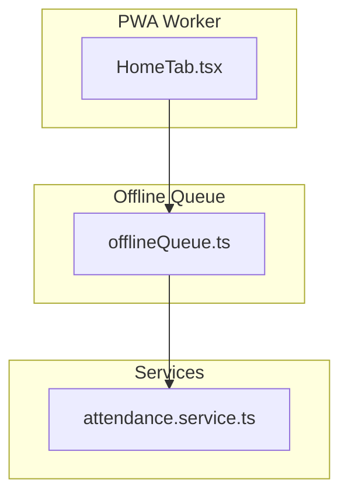
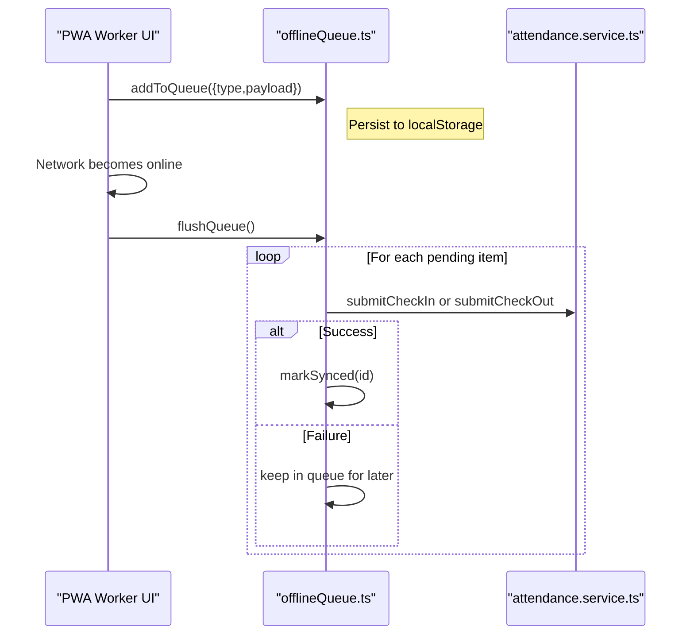
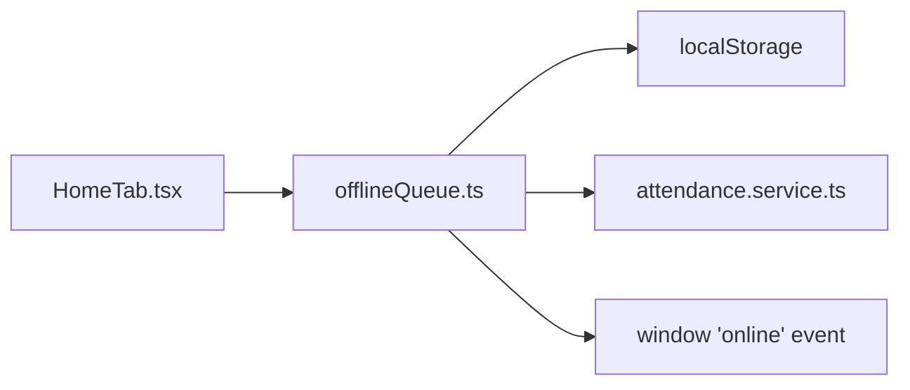

# Offline Queue Management

<cite>
**Referenced Files in This Document**
- [offlineQueue.ts](file://src/utils/offlineQueue.ts)
- [DESIGN.md](file://DESIGN.md)
- [ANALISIS_APLIKASI.md](file://ANALISIS_APLIKASI.md)
- [HomeTab.tsx](file://src/components/pwa/HomeTab.tsx)
- [attendance.service.ts](file://src/services/attendance.service.ts)
</cite>

## Table of Contents
1. [Introduction](#introduction)
2. [Project Structure](#project-structure)
3. [Core Components](#core-components)
4. [Architecture Overview](#architecture-overview)
5. [Detailed Component Analysis](#detailed-component-analysis)
6. [Dependency Analysis](#dependency-analysis)
7. [Performance Considerations](#performance-considerations)
8. [Troubleshooting Guide](#troubleshooting-guide)
9. [Conclusion](#conclusion)
10. [Appendices](#appendices)

## Introduction
This document explains the offline queue management system in AbsensiOnline’s PWA worker. It covers how failed attendance actions (check-in/check-out) are captured, persisted locally, and retried when connectivity is restored. It also documents queue state management, retry behavior, conflict handling, integration with the service layer, performance characteristics, and testing/debugging approaches.

## Project Structure
The offline queue is implemented as a small utility module that persists items to browser storage and coordinates retries with attendance services. The PWA worker tabs coordinate triggering of flush operations upon network restoration.

**Diagram sources**
- [offlineQueue.ts:1-97](file://src/utils/offlineQueue.ts#L1-L97)
- [HomeTab.tsx](file://src/components/pwa/HomeTab.tsx)
- [attendance.service.ts](file://src/services/attendance.service.ts)

**Section sources**
- [offlineQueue.ts:1-97](file://src/utils/offlineQueue.ts#L1-L97)
- [DESIGN.md:270-345](file://DESIGN.md#L270-L345)
- [ANALISIS_APLIKASI.md:10-100](file://ANALISIS_APLIKASI.md#L10-L100)

## Core Components
- QueueItem model: uniquely identifies each action, tracks type (check-in or check-out), payload, timestamp, and synced state.
- Local persistence keys: queue storage key and daily local attendance record key.
- Queue operations:
  - Retrieve pending queue entries
  - Add new items to the queue
  - Mark items as synced after successful submission
  - Flush pending items to the server
- Daily attendance record helpers: track a local “today” record keyed by date to avoid stale cross-day submissions.

Key responsibilities:
- Persist queue and today record to localStorage
- Coordinate with attendance service functions for submission
- Maintain FIFO order during flush
- Filter out already-synced items

**Section sources**
- [offlineQueue.ts:3-18](file://src/utils/offlineQueue.ts#L3-L18)
- [offlineQueue.ts:44-64](file://src/utils/offlineQueue.ts#L44-L64)
- [offlineQueue.ts:20-42](file://src/utils/offlineQueue.ts#L20-L42)

## Architecture Overview
The offline queue is a thin layer over localStorage and attendance services. The PWA worker triggers flush when the device comes back online. Successful submissions remove items from the queue; failures remain queued for later retry.

**Diagram sources**
- [offlineQueue.ts:53-96](file://src/utils/offlineQueue.ts#L53-L96)
- [attendance.service.ts](file://src/services/attendance.service.ts)

**Section sources**
- [DESIGN.md:329-342](file://DESIGN.md#L329-L342)
- [offlineQueue.ts:66-96](file://src/utils/offlineQueue.ts#L66-L96)

## Detailed Component Analysis

### QueueItem Model and Local Persistence Keys
- QueueItem fields: id, type, payload, timestamp, synced.
- Local keys:
  - Queue storage key for pending items
  - Local today key for daily attendance record

Behavior:
- Today record is cleared automatically if the stored date does not match the current day.

**Section sources**
- [offlineQueue.ts:3-18](file://src/utils/offlineQueue.ts#L3-L18)
- [offlineQueue.ts:20-42](file://src/utils/offlineQueue.ts#L20-L42)

### Queue Retrieval and Mutation
- Retrieve pending queue: parse stored JSON or return empty array.
- Add to queue: append new item with random id and unsynced flag.
- Mark synced: update item’s synced flag and filter out synced items from storage.

Notes:
- The queue is stored as a JSON array in localStorage.
- markSynced updates in-memory state and writes back to storage, ensuring only pending items remain.

**Section sources**
- [offlineQueue.ts:44-64](file://src/utils/offlineQueue.ts#L44-L64)

### Flush Mechanism and Retry Logic
- Fetch pending items (unsynced).
- Iterate sequentially:
  - For check-in: call submitCheckIn with payload.
  - For check-out: call submitCheckOut with extracted parameters.
  - On success, mark item as synced and increment counter.
  - On failure, swallow error and leave item in queue for later retry.
- Returns count of successfully flushed items.

Concurrency:
- Iterates sequentially rather than concurrently to simplify ordering and reduce race conditions.

**Section sources**
- [offlineQueue.ts:66-96](file://src/utils/offlineQueue.ts#L66-L96)

### Integration with Attendance Services
- Uses submitCheckIn and submitCheckOut from the attendance service.
- Payload shapes:
  - Check-in: generic payload object
  - Check-out: expects attendanceId plus location/timestamp fields

Error handling:
- Exceptions inside flush are caught and ignored, preserving items for future attempts.

**Section sources**
- [offlineQueue.ts:1-1](file://src/utils/offlineQueue.ts#L1-L1)
- [offlineQueue.ts:72-89](file://src/utils/offlineQueue.ts#L72-L89)

### Daily Local Attendance Record
- getLocalTodayAttendance validates that the stored record belongs to the current calendar day.
- setLocalTodayAttendance stores a record with id, timestamp, and optional checkout time.
- clearLocalTodayAttendance removes stale records.

Usage:
- Prevents cross-day submissions and ensures coherent daily boundaries.

**Section sources**
- [offlineQueue.ts:20-42](file://src/utils/offlineQueue.ts#L20-L42)

### PWA Online Event Handling
- The PWA listens for the global online event and triggers flush when connectivity is restored.
- This is the primary mechanism to drain the offline queue.

**Section sources**
- [DESIGN.md:329-342](file://DESIGN.md#L329-L342)

## Dependency Analysis
The offline queue depends on:
- localStorage for persistence
- attendance service functions for remote submission
- Global online event for flush activation

**Diagram sources**
- [offlineQueue.ts:1-97](file://src/utils/offlineQueue.ts#L1-L97)
- [HomeTab.tsx](file://src/components/pwa/HomeTab.tsx)
- [DESIGN.md:329-342](file://DESIGN.md#L329-L342)

**Section sources**
- [offlineQueue.ts:1-1](file://src/utils/offlineQueue.ts#L1-L1)
- [DESIGN.md:329-342](file://DESIGN.md#L329-L342)

## Performance Considerations
- Storage overhead: Queue and today record are stored as JSON arrays/objects; size grows with pending items.
- Flush cost: Sequential iteration prevents concurrency but reduces complexity and potential conflicts.
- Memory footprint: Queue is loaded entirely from storage on each operation; very large queues could cause parsing overhead.
- Network efficiency: Retries occur only when online; batching is implicit through flush.

Recommendations:
- Keep payloads minimal (only required fields).
- Monitor queue length and warn users if it grows excessively.
- Consider periodic trimming of very old items if needed.

[No sources needed since this section provides general guidance]

## Troubleshooting Guide
Common issues and resolutions:
- Items never flush:
  - Verify online event listener is registered and reachable.
  - Ensure attendance service functions resolve successfully.
- Stuck items:
  - Check that markSynced is executed after successful submission.
  - Confirm payload shape matches service expectations.
- Cross-day submissions:
  - Ensure getLocalTodayAttendance clears stale records and that new submissions are prevented until a fresh record is set.

Debugging tips:
- Inspect localStorage keys for queue and today record.
- Temporarily log flush results and individual item outcomes.
- Simulate offline/online transitions to observe retry behavior.

**Section sources**
- [offlineQueue.ts:66-96](file://src/utils/offlineQueue.ts#L66-L96)
- [offlineQueue.ts:20-42](file://src/utils/offlineQueue.ts#L20-L42)

## Conclusion
The offline queue provides a pragmatic, localStorage-backed solution for PWA check-in/check-out resiliency. It offers simple persistence, ordered retries, and clean separation between UI, persistence, and service layers. While basic, it satisfies MVP requirements and can be extended with priorities, concurrency, and queue limits in future iterations.

[No sources needed since this section summarizes without analyzing specific files]

## Appendices

### Function Reference
- getPendingQueue(): retrieves pending items
- addToQueue(item): adds a new item to the queue
- markSynced(id): marks an item as synced and prunes the queue
- flushQueue(): iterates pending items and submits via attendance service
- getLocalTodayAttendance()/setLocalTodayAttendance()/clearLocalTodayAttendance(): manage daily attendance record

Integration points:
- attendance.service.ts submitCheckIn and submitCheckOut
- PWA online event handling in HomeTab.tsx

**Section sources**
- [offlineQueue.ts:44-96](file://src/utils/offlineQueue.ts#L44-L96)
- [DESIGN.md:329-342](file://DESIGN.md#L329-L342)