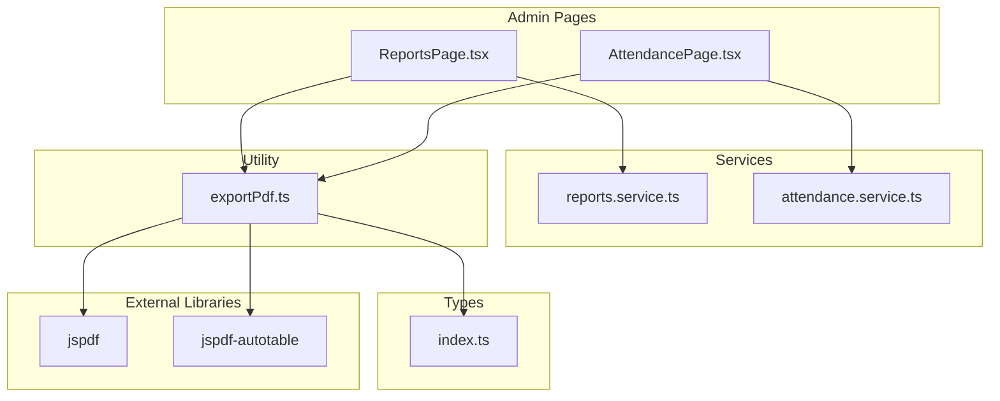
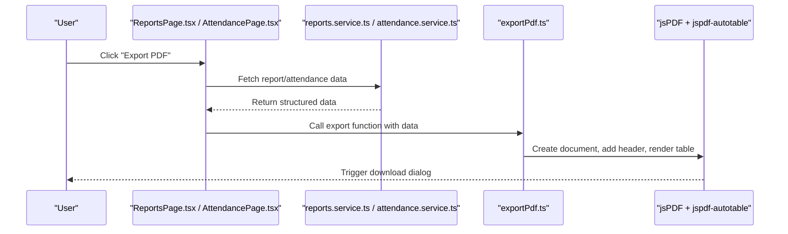
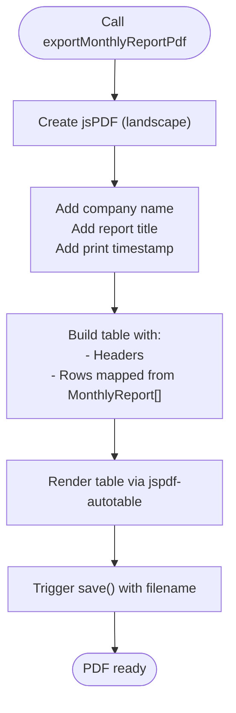
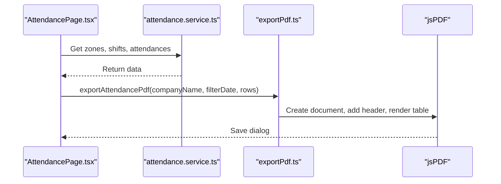
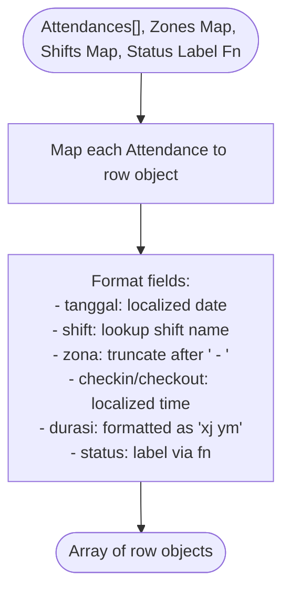
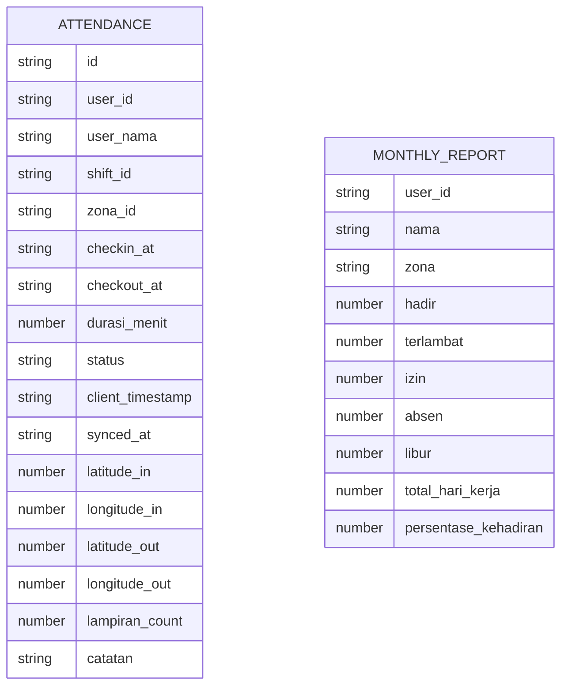
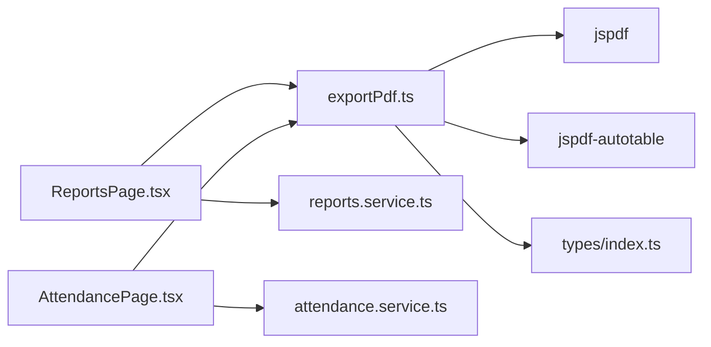

# PDF Export Functionality

<cite>
**Referenced Files in This Document**
- [exportPdf.ts](file://src/utils/exportPdf.ts)
- [ReportsPage.tsx](file://src/components/admin/ReportsPage.tsx)
- [AttendancePage.tsx](file://src/components/admin/AttendancePage.tsx)
- [reports.service.ts](file://src/services/reports.service.ts)
- [attendance.service.ts](file://src/services/attendance.service.ts)
- [index.ts](file://src/types/index.ts)
- [package.json](file://package.json)
</cite>

## Table of Contents
1. [Introduction](#introduction)
2. [Project Structure](#project-structure)
3. [Core Components](#core-components)
4. [Architecture Overview](#architecture-overview)
5. [Detailed Component Analysis](#detailed-component-analysis)
6. [Dependency Analysis](#dependency-analysis)
7. [Performance Considerations](#performance-considerations)
8. [Troubleshooting Guide](#troubleshooting-guide)
9. [Conclusion](#conclusion)

## Introduction
This document explains the PDF export functionality in AbsensiOnline, focusing on the jsPDF integration and related utilities. It covers how attendance reports and worker attendance records are transformed into PDF documents, including document creation, layout management, formatting options, and customization capabilities. It also provides usage examples, performance considerations for large datasets, and browser compatibility guidance.

## Project Structure
The PDF export capability is implemented as a small utility module that integrates with the admin pages and services:

- Utility module: transforms raw data into PDF-ready tabular structures and generates PDFs
- Admin pages: trigger exports from user actions and pass formatted data to the utility
- Services: supply the data used for generating reports and attendance lists
- Types: define the data structures consumed by the export functions

**Diagram sources**
- [ReportsPage.tsx:115-119](file://src/components/admin/ReportsPage.tsx#L115-L119)
- [AttendancePage.tsx:179-191](file://src/components/admin/AttendancePage.tsx#L179-L191)
- [reports.service.ts:16-81](file://src/services/reports.service.ts#L16-L81)
- [attendance.service.ts:16-23](file://src/services/attendance.service.ts#L16-L23)
- [exportPdf.ts:1-109](file://src/utils/exportPdf.ts#L1-L109)
- [index.ts:107-118](file://src/types/index.ts#L107-L118)
- [package.json:18-19](file://package.json#L18-L19)

**Section sources**
- [ReportsPage.tsx:115-119](file://src/components/admin/ReportsPage.tsx#L115-L119)
- [AttendancePage.tsx:179-191](file://src/components/admin/AttendancePage.tsx#L179-L191)
- [reports.service.ts:16-81](file://src/services/reports.service.ts#L16-L81)
- [attendance.service.ts:16-23](file://src/services/attendance.service.ts#L16-L23)
- [exportPdf.ts:1-109](file://src/utils/exportPdf.ts#L1-L109)
- [index.ts:107-118](file://src/types/index.ts#L107-L118)
- [package.json:18-19](file://package.json#L18-L19)

## Core Components
- exportMonthlyReportPdf: Generates a landscape-oriented PDF for monthly attendance summaries
- exportAttendancePdf: Generates a landscape-oriented PDF for filtered attendance records
- attendanceToPdfRows: Transforms Attendance entities into a table-friendly row structure with localized formatting and labels

Key features:
- Document orientation: landscape for better fit of tabular data
- Header with company name, report title, and print timestamp
- Auto-generated table via jspdf-autotable with configurable styles and header colors
- Filename generation based on report metadata

**Section sources**
- [exportPdf.ts:9-43](file://src/utils/exportPdf.ts#L9-L43)
- [exportPdf.ts:45-85](file://src/utils/exportPdf.ts#L45-L85)
- [exportPdf.ts:87-109](file://src/utils/exportPdf.ts#L87-L109)

## Architecture Overview
The export pipeline connects UI actions to data services, then to the export utility, and finally to jsPDF for rendering.

**Diagram sources**
- [ReportsPage.tsx:115-119](file://src/components/admin/ReportsPage.tsx#L115-L119)
- [AttendancePage.tsx:183-187](file://src/components/admin/AttendancePage.tsx#L183-L187)
- [reports.service.ts:16-81](file://src/services/reports.service.ts#L16-L81)
- [attendance.service.ts:16-23](file://src/services/attendance.service.ts#L16-L23)
- [exportPdf.ts:9-43](file://src/utils/exportPdf.ts#L9-L43)

## Detailed Component Analysis

### Monthly Report Export
The monthly report export creates a PDF summarizing worker attendance counts and percentages.

**Diagram sources**
- [exportPdf.ts:9-43](file://src/utils/exportPdf.ts#L9-L43)

Usage example:
- Triggered from the Reports page when the user clicks the export button
- Uses company name, month label, year, and MonthlyReport[] array

Parameters:
- companyName: string
- monthLabel: string
- year: number
- rows: MonthlyReport[]

Formatting options:
- Orientation: landscape
- Font sizes: 14 (title), 11 (subtitle), 9 (timestamp)
- Table styles: font size 8, header background color [22, 163, 74]

**Section sources**
- [ReportsPage.tsx:115-119](file://src/components/admin/ReportsPage.tsx#L115-L119)
- [exportPdf.ts:9-43](file://src/utils/exportPdf.ts#L9-L43)
- [index.ts:107-118](file://src/types/index.ts#L107-L118)

### Attendance Records Export
The attendance export converts filtered Attendance records into a PDF table.

**Diagram sources**
- [AttendancePage.tsx:179-191](file://src/components/admin/AttendancePage.tsx#L179-L191)
- [attendance.service.ts:16-23](file://src/services/attendance.service.ts#L16-L23)
- [exportPdf.ts:45-85](file://src/utils/exportPdf.ts#L45-L85)

Usage example:
- User applies filters (date, zone, shift, status)
- Clicking export triggers conversion and PDF generation

Parameters:
- companyName: string
- filterDate: string (ISO date)
- rows: Array of objects with keys: user_nama, tanggal, shift, zona, checkin, checkout, durasi, status

Formatting options:
- Orientation: landscape
- Font sizes: 14 (title), 11 (subtitle), 9 (timestamp)
- Table styles: font size 8, header background color [22, 163, 74]

**Section sources**
- [AttendancePage.tsx:179-191](file://src/components/admin/AttendancePage.tsx#L179-L191)
- [exportPdf.ts:45-85](file://src/utils/exportPdf.ts#L45-L85)

### Data Transformation Utility
The utility function attendanceToPdfRows prepares Attendance entities for PDF export by mapping IDs to names, formatting dates/times/durations, and translating status values.

**Diagram sources**
- [exportPdf.ts:87-109](file://src/utils/exportPdf.ts#L87-L109)

**Section sources**
- [exportPdf.ts:87-109](file://src/utils/exportPdf.ts#L87-L109)

### Data Models Used by Export Functions
The export functions consume typed data structures defined in the types module.

**Diagram sources**
- [index.ts:60-78](file://src/types/index.ts#L60-L78)
- [index.ts:107-118](file://src/types/index.ts#L107-L118)

**Section sources**
- [index.ts:60-78](file://src/types/index.ts#L60-L78)
- [index.ts:107-118](file://src/types/index.ts#L107-L118)

## Dependency Analysis
The export functionality depends on external libraries and internal modules:

- jsPDF: core PDF generation
- jspdf-autotable: automatic table rendering
- Internal modules: services for data retrieval, types for shape validation, and UI pages for triggering exports

**Diagram sources**
- [exportPdf.ts:1-3](file://src/utils/exportPdf.ts#L1-L3)
- [ReportsPage.tsx:1-10](file://src/components/admin/ReportsPage.tsx#L1-L10)
- [AttendancePage.tsx:1-14](file://src/components/admin/AttendancePage.tsx#L1-L14)
- [reports.service.ts:1-8](file://src/services/reports.service.ts#L1-L8)
- [attendance.service.ts:1-9](file://src/services/attendance.service.ts#L1-L9)
- [package.json:18-19](file://package.json#L18-L19)

**Section sources**
- [exportPdf.ts:1-3](file://src/utils/exportPdf.ts#L1-L3)
- [ReportsPage.tsx:1-10](file://src/components/admin/ReportsPage.tsx#L1-L10)
- [AttendancePage.tsx:1-14](file://src/components/admin/AttendancePage.tsx#L1-L14)
- [reports.service.ts:1-8](file://src/services/reports.service.ts#L1-L8)
- [attendance.service.ts:1-9](file://src/services/attendance.service.ts#L1-L9)
- [package.json:18-19](file://package.json#L18-L19)

## Performance Considerations
- Large datasets: Rendering very large arrays in the browser can increase memory usage and slow down UI responsiveness. Consider:
  - Paginating data before export (already paginated in AttendancePage)
  - Limiting export range (date filters)
  - Using virtualized rendering for extremely large tables (jspdf-autotable supports pagination via its own options)
- Formatting costs: Converting dates and durations for each row adds overhead. Keep transformations minimal and reuse maps (shifts, zones) as shown in the code.
- Memory management: Avoid retaining large intermediate arrays after export completes. The current implementation passes data directly to the export function and does not store extra references.
- Browser capabilities: jsPDF relies on browser APIs. Ensure the environment supports Blob and URL.createObjectURL for saving files.

[No sources needed since this section provides general guidance]

## Troubleshooting Guide
Common issues and resolutions:
- Empty or missing data:
  - Verify that services return success before calling export functions
  - Ensure filters are applied correctly (e.g., date range, zone/shift selection)
- Incorrect column order or missing fields:
  - Confirm that exported row objects match the expected keys used by jspdf-autotable
- Styling inconsistencies:
  - Adjust font sizes and header colors in the export functions
- Filename conflicts:
  - Modify the filename template to include unique identifiers (e.g., timestamp)

**Section sources**
- [ReportsPage.tsx:115-119](file://src/components/admin/ReportsPage.tsx#L115-L119)
- [AttendancePage.tsx:179-191](file://src/components/admin/AttendancePage.tsx#L179-L191)
- [exportPdf.ts:9-43](file://src/utils/exportPdf.ts#L9-L43)
- [exportPdf.ts:45-85](file://src/utils/exportPdf.ts#L45-L85)

## Conclusion
The PDF export functionality in AbsensiOnline leverages jsPDF and jspdf-autotable to produce professional, printable reports from attendance data. The implementation is modular, with clear separation between data preparation, formatting, and PDF generation. By following the usage patterns and performance recommendations outlined here, teams can reliably export monthly summaries and daily attendance records while maintaining good user experience and browser compatibility.