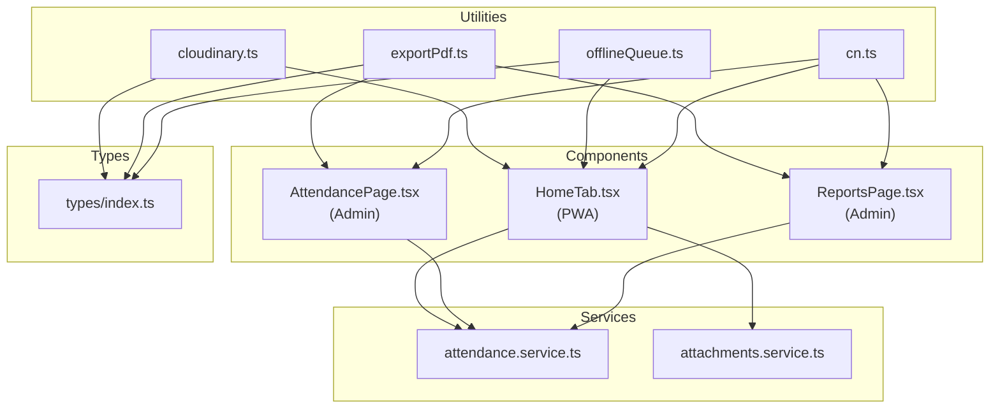
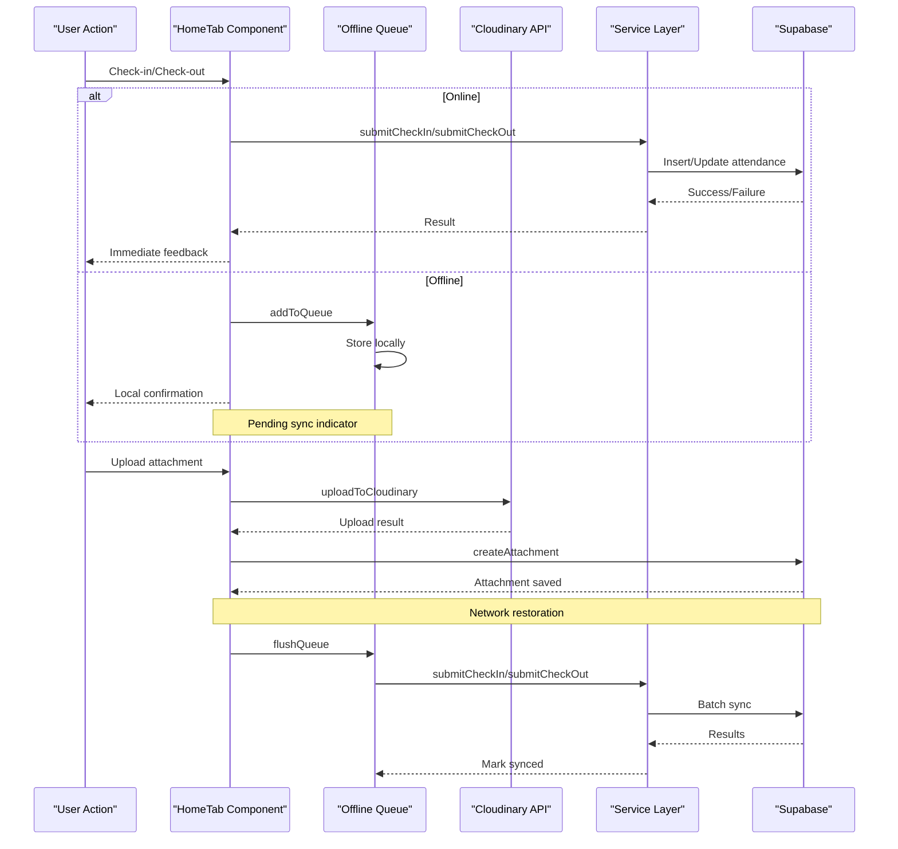
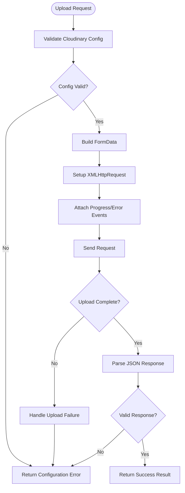
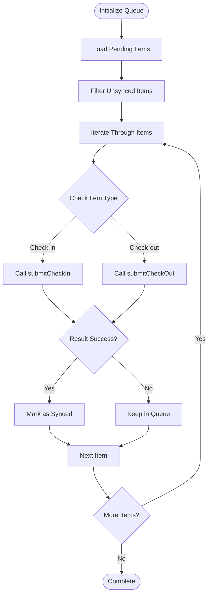
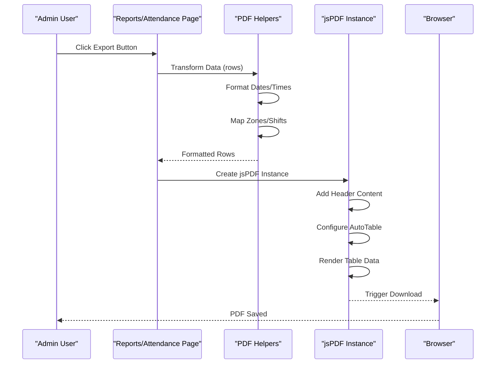
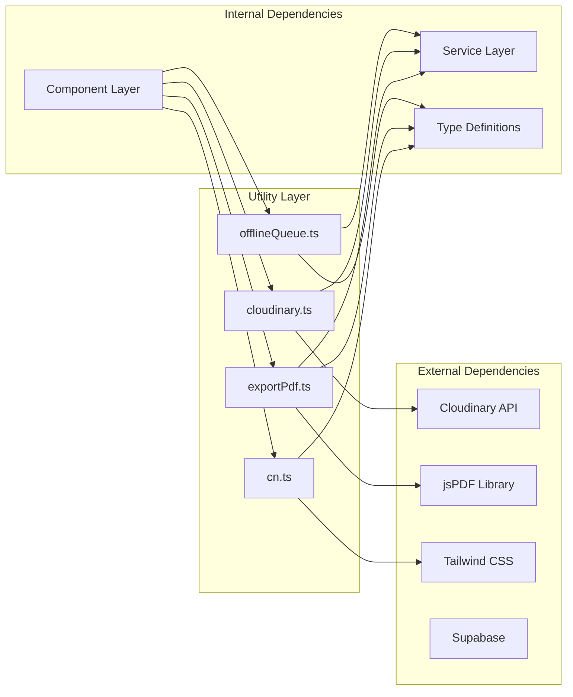

# Utility Functions

<cite>
**Referenced Files in This Document**
- [cloudinary.ts](file://src/utils/cloudinary.ts)
- [cn.ts](file://src/utils/cn.ts)
- [exportPdf.ts](file://src/utils/exportPdf.ts)
- [offlineQueue.ts](file://src/utils/offlineQueue.ts)
- [types/index.ts](file://src/types/index.ts)
- [attendance.service.ts](file://src/services/attendance.service.ts)
- [HomeTab.tsx](file://src/components/pwa/HomeTab.tsx)
- [AttendancePage.tsx](file://src/components/admin/AttendancePage.tsx)
- [ReportsPage.tsx](file://src/components/admin/ReportsPage.tsx)
</cite>

## Table of Contents
1. [Introduction](#introduction)
2. [Project Structure](#project-structure)
3. [Core Components](#core-components)
4. [Architecture Overview](#architecture-overview)
5. [Detailed Component Analysis](#detailed-component-analysis)
6. [Dependency Analysis](#dependency-analysis)
7. [Performance Considerations](#performance-considerations)
8. [Troubleshooting Guide](#troubleshooting-guide)
9. [Conclusion](#conclusion)

## Introduction
This document provides comprehensive utility function documentation for AbsensiOnline, focusing on four key utility modules:
- Cloudinary integration for image uploads and processing
- PDF export functionality using jsPDF
- Offline queue management for PWA functionality
- Utility helpers like cn for conditional class names

The utilities integrate with external services and core application features to enable robust offline-first behavior, efficient data export, and streamlined asset management.

## Project Structure
The utility functions are organized under the src/utils directory and are consumed by various components across the application:

**Diagram sources**
- [cloudinary.ts:1-63](file://src/utils/cloudinary.ts#L1-L63)
- [exportPdf.ts:1-109](file://src/utils/exportPdf.ts#L1-L109)
- [offlineQueue.ts:1-97](file://src/utils/offlineQueue.ts#L1-L97)
- [cn.ts:1-7](file://src/utils/cn.ts#L1-L7)
- [HomeTab.tsx:1-200](file://src/components/pwa/HomeTab.tsx#L1-L200)
- [AttendancePage.tsx:1-355](file://src/components/admin/AttendancePage.tsx#L1-L355)
- [ReportsPage.tsx:1-232](file://src/components/admin/ReportsPage.tsx#L1-L232)
- [types/index.ts:1-182](file://src/types/index.ts#L1-L182)

**Section sources**
- [cloudinary.ts:1-63](file://src/utils/cloudinary.ts#L1-L63)
- [exportPdf.ts:1-109](file://src/utils/exportPdf.ts#L1-L109)
- [offlineQueue.ts:1-97](file://src/utils/offlineQueue.ts#L1-L97)
- [cn.ts:1-7](file://src/utils/cn.ts#L1-L7)

## Core Components
This section documents each utility module with function signatures, parameters, return values, and usage patterns.

### Cloudinary Integration (`src/utils/cloudinary.ts`)
The Cloudinary utility provides a standardized interface for uploading files to Cloudinary with progress tracking and comprehensive error handling.

**Function Signature**: `uploadToCloudinary(file: File, folder: string, onProgress?: (percent: number) => void): Promise<ServiceResult<CloudinaryResponse>>`

**Parameters**:
- `file`: The File object to upload
- `folder`: Destination folder path in Cloudinary
- `onProgress`: Optional callback receiving upload progress percentage

**Return Value**: A ServiceResult object containing either success data with CloudinaryResponse or error information

**CloudinaryResponse Structure**:
- `secure_url`: HTTPS URL of uploaded asset
- `public_id`: Unique identifier in Cloudinary
- `format`: File format extension
- `bytes`: File size in bytes
- `resource_type`: Resource type (image/video/etc.)

**Usage Pattern**: The function constructs FormData with file, upload preset, and folder, then performs an XMLHttpRequest to Cloudinary's API endpoint. Progress events are forwarded to the optional callback, while completion events parse the JSON response and validate the upload result.

**Integration**: Used extensively in the PWA HomeTab component for photo/document uploads with automatic compression for images.

**Section sources**
- [cloudinary.ts:11-62](file://src/utils/cloudinary.ts#L11-L62)
- [types/index.ts:137-140](file://src/types/index.ts#L137-L140)

### PDF Export (`src/utils/exportPdf.ts`)
The PDF utility module provides two primary functions for exporting attendance data to PDF format using jsPDF and jspdf-autotable.

**Monthly Report Export**:
- `exportMonthlyReportPdf(companyName: string, monthLabel: string, year: number, rows: MonthlyReport[]): void`
- Creates landscape-oriented PDF with company header, report title, print timestamp, and formatted table

**Attendance Data Export**:
- `exportAttendancePdf(companyName: string, filterDate: string, rows: AttendanceRow[]): void`
- Generates detailed attendance records with worker information, timestamps, and status indicators

**Data Transformation Helper**:
- `attendanceToPdfRows(attendances: Attendance[], zones: Map<string, string>, shifts: Map<string, string>, statusLabel: (s: Attendance['status']) => string): AttendanceRow[]`
- Converts Attendance objects to PDF-friendly row format with localized dates and formatted durations

**Usage Pattern**: Both export functions create a jsPDF instance, add header information, apply autoTable formatting, and trigger browser download. The helper function transforms complex data structures into tabular format suitable for PDF rendering.

**Integration**: Consumed by Admin components (AttendancePage and ReportsPage) to provide downloadable reports of attendance data.

**Section sources**
- [exportPdf.ts:9-109](file://src/utils/exportPdf.ts#L9-L109)
- [types/index.ts:60-118](file://src/types/index.ts#L60-L118)

### Offline Queue Management (`src/utils/offlineQueue.ts`)
The offline queue utility enables offline-first functionality by storing actions locally and synchronizing when network connectivity is restored.

**Core Interfaces**:
- `QueueItem`: `{ id: string; type: 'checkin' | 'checkout'; payload: Record<string, unknown>; timestamp: string; synced: boolean }`
- `LocalTodayRecord`: `{ id: string; timestamp: string; checkOutAt: string | null }`

**Primary Functions**:
- `getLocalTodayAttendance(): LocalTodayRecord | null`: Retrieves today's attendance record from localStorage
- `setLocalTodayAttendance(record: LocalTodayRecord): void`: Stores today's attendance record
- `clearLocalTodayAttendance(): void`: Removes today's attendance record
- `getPendingQueue(): QueueItem[]`: Loads queued actions from localStorage
- `addToQueue(item: Omit<QueueItem, 'id' | 'synced'>): void`: Adds action to queue with unique ID
- `markSynced(id: string): void`: Marks specific queue item as synchronized
- `flushQueue(): Promise<number>`: Processes all pending actions and returns count of successful syncs

**Processing Logic**: The flushQueue function iterates through pending items, dispatching to appropriate service functions (submitCheckIn or submitCheckOut) and marking items as synced upon success. Failed items remain in the queue for later retry attempts.

**Integration**: Central to PWA functionality in HomeTab component, enabling check-in/check-out operations when offline and automatic synchronization when connectivity is restored.

**Section sources**
- [offlineQueue.ts:3-96](file://src/utils/offlineQueue.ts#L3-L96)
- [attendance.service.ts:25-77](file://src/services/attendance.service.ts#L25-L77)

### Conditional Class Names (`src/utils/cn.ts`)
The cn utility provides a clean interface for conditionally merging Tailwind CSS classes using clsx and tailwind-merge.

**Function Signature**: `cn(...inputs: ClassValue[]): string`

**Parameters**: Spread of class values (strings, objects, arrays, or null/undefined values)

**Return Value**: Merged and deduplicated CSS class string

**Usage Pattern**: Accepts any combination of string literals, conditional expressions, and object conditionals, then applies tailwind-merge to prevent conflicting classes while maintaining order.

**Integration**: Used throughout UI components for dynamic styling based on state and props.

**Section sources**
- [cn.ts:4-6](file://src/utils/cn.ts#L4-L6)

## Architecture Overview
The utility functions form the backbone of AbsensiOnline's offline-first architecture and data export capabilities:

**Diagram sources**
- [HomeTab.tsx:315-410](file://src/components/pwa/HomeTab.tsx#L315-L410)
- [offlineQueue.ts:66-96](file://src/utils/offlineQueue.ts#L66-L96)
- [cloudinary.ts:11-62](file://src/utils/cloudinary.ts#L11-L62)
- [attendance.service.ts:25-77](file://src/services/attendance.service.ts#L25-L77)

## Detailed Component Analysis

### Cloudinary Upload Workflow
The upload process follows a structured flow with comprehensive error handling:

**Diagram sources**
- [cloudinary.ts:19-61](file://src/utils/cloudinary.ts#L19-L61)

**Key Features**:
- Environment-based configuration validation
- Progress event forwarding for UI feedback
- Comprehensive error handling for network failures
- JSON parsing with fallback error handling

**Section sources**
- [cloudinary.ts:11-62](file://src/utils/cloudinary.ts#L11-L62)

### Offline Queue Processing
The queue management system ensures reliable data persistence and synchronization:

**Diagram sources**
- [offlineQueue.ts:66-96](file://src/utils/offlineQueue.ts#L66-L96)

**Error Handling Strategy**:
- Individual item failures don't block queue processing
- Failed items remain queued for retry
- Network errors are caught and logged silently
- Queue state persists across browser sessions

**Section sources**
- [offlineQueue.ts:44-96](file://src/utils/offlineQueue.ts#L44-L96)

### PDF Generation Pipeline
The PDF export system transforms application data into printable reports:

**Diagram sources**
- [exportPdf.ts:87-109](file://src/utils/exportPdf.ts#L87-L109)
- [AttendancePage.tsx:180-191](file://src/components/admin/AttendancePage.tsx#L180-L191)
- [ReportsPage.tsx:115-119](file://src/components/admin/ReportsPage.tsx#L115-L119)

**Data Transformation Process**:
- Attendance objects converted to human-readable format
- Geographic coordinates formatted for display
- Durations calculated and formatted as "Xh Ym"
- Status values mapped to localized labels

**Section sources**
- [exportPdf.ts:9-109](file://src/utils/exportPdf.ts#L9-L109)

### Component Integration Patterns
The utilities integrate seamlessly across different application layers:

**PWA HomeTab Integration**:
- Offline queue for check-in/check-out operations
- Cloudinary integration for photo/document uploads
- Real-time progress tracking for user feedback
- Automatic synchronization when connectivity restores

**Admin Reporting Integration**:
- PDF export for monthly attendance summaries
- Detailed attendance reports with filtering capabilities
- Data transformation for optimal table presentation

**UI Component Integration**:
- Conditional class names for responsive styling
- Consistent component styling across the application
- Dynamic class application based on state and props

**Section sources**
- [HomeTab.tsx:1-200](file://src/components/pwa/HomeTab.tsx#L1-L200)
- [AttendancePage.tsx:170-191](file://src/components/admin/AttendancePage.tsx#L170-L191)
- [ReportsPage.tsx:110-120](file://src/components/admin/ReportsPage.tsx#L110-L120)

## Dependency Analysis
The utility functions have minimal external dependencies and maintain loose coupling with the rest of the application:

**Diagram sources**
- [cloudinary.ts:1-63](file://src/utils/cloudinary.ts#L1-L63)
- [exportPdf.ts:1-109](file://src/utils/exportPdf.ts#L1-L109)
- [offlineQueue.ts:1-97](file://src/utils/offlineQueue.ts#L1-L97)
- [cn.ts:1-7](file://src/utils/cn.ts#L1-L7)

**Key Dependencies**:
- Cloudinary: HTTP-based image/video upload service
- jsPDF: Client-side PDF generation library
- Supabase: Backend-as-a-Service for data persistence
- Tailwind CSS: Utility-first CSS framework

**Section sources**
- [cloudinary.ts:1-63](file://src/utils/cloudinary.ts#L1-L63)
- [exportPdf.ts:1-109](file://src/utils/exportPdf.ts#L1-L109)
- [offlineQueue.ts:1-97](file://src/utils/offlineQueue.ts#L1-L97)
- [cn.ts:1-7](file://src/utils/cn.ts#L1-L7)

## Performance Considerations
Each utility function incorporates performance optimizations and considerations:

### Cloudinary Upload Performance
- **Progressive Feedback**: Real-time upload progress updates prevent UI blocking
- **Compression**: Image compression reduces bandwidth usage and storage costs
- **Error Boundaries**: Network failures are isolated to individual uploads
- **Environment Validation**: Early configuration checks prevent unnecessary requests

### PDF Generation Performance
- **Client-Side Rendering**: PDF creation occurs in browser, reducing server load
- **Efficient Data Transformation**: Optimized mapping functions minimize computation overhead
- **AutoTable Optimization**: Efficient table rendering for large datasets
- **Memory Management**: Proper cleanup of blob URLs prevents memory leaks

### Offline Queue Performance
- **Batch Processing**: Queue items processed sequentially to maintain order
- **Selective Updates**: Only unsynced items are processed during flush
- **Local Storage Efficiency**: Minimal data serialization overhead
- **Retry Strategy**: Failed items automatically retried without manual intervention

### Conditional Class Names Performance
- **Lazy Evaluation**: Classes computed only when component renders
- **Merge Optimization**: tailwind-merge prevents redundant class combinations
- **Type Safety**: Compile-time validation prevents runtime class conflicts

## Troubleshooting Guide

### Cloudinary Upload Issues
**Common Problems**:
- Configuration errors: Verify VITE_CLOUDINARY_CLOUD_NAME and VITE_CLOUDINARY_UPLOAD_PRESET environment variables
- Network connectivity: Check browser console for CORS or network errors
- File size limits: Ensure files comply with configured maximum sizes
- Progress tracking: Verify onProgress callback receives integer percentages

**Diagnostic Steps**:
1. Check Cloudinary dashboard for upload activity
2. Verify file format compatibility
3. Monitor network tab for failed requests
4. Validate upload preset permissions

### Offline Queue Synchronization
**Common Problems**:
- Items not syncing: Check localStorage quota and corruption
- Partial sync failures: Review individual item error messages
- Stuck queue: Clear localStorage queue manually if needed
- Duplicate entries: Verify unique ID generation

**Diagnostic Steps**:
1. Inspect localStorage for queue data
2. Check network connectivity during flush operation
3. Review service layer error responses
4. Monitor console for exception traces

### PDF Generation Issues
**Common Problems**:
- Missing data: Verify input data completeness
- Formatting errors: Check column definitions match data structure
- Browser compatibility: Test across supported browsers
- Large dataset performance: Consider pagination for massive exports

**Diagnostic Steps**:
1. Validate data structure against expected types
2. Check browser console for JavaScript errors
3. Verify jsPDF and autotable versions
4. Test with smaller datasets first

### Conditional Class Names
**Common Problems**:
- Conflicting classes: tailwind-merge should handle conflicts automatically
- Runtime errors: Ensure all inputs are valid CSS class strings
- Style inconsistencies: Verify Tailwind configuration

**Diagnostic Steps**:
1. Check browser developer tools for rendered class strings
2. Validate input parameters are strings or objects
3. Review Tailwind build output for missing classes

**Section sources**
- [cloudinary.ts:19-61](file://src/utils/cloudinary.ts#L19-L61)
- [offlineQueue.ts:66-96](file://src/utils/offlineQueue.ts#L66-L96)
- [exportPdf.ts:5-8](file://src/utils/exportPdf.ts#L5-L8)

## Conclusion
The utility functions in AbsensiOnline provide a robust foundation for modern web application development with offline-first capabilities, efficient data export, and streamlined asset management. Each utility maintains clear separation of concerns while integrating seamlessly with the broader application architecture.

Key strengths include comprehensive error handling, performance optimizations, and practical integration patterns demonstrated across the PWA and admin components. The modular design allows for easy maintenance and potential expansion to additional utility functions as the application evolves.

The utilities collectively enable AbsensiOnline to deliver reliable functionality across diverse network conditions while maintaining excellent user experience through immediate feedback and graceful degradation when connectivity is unavailable.